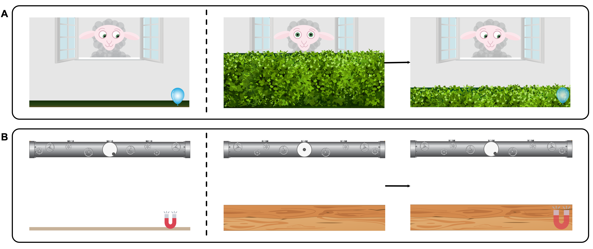
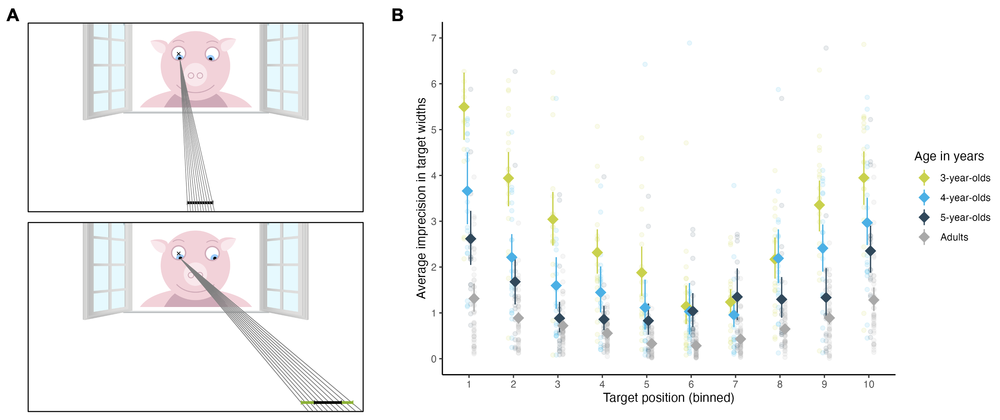
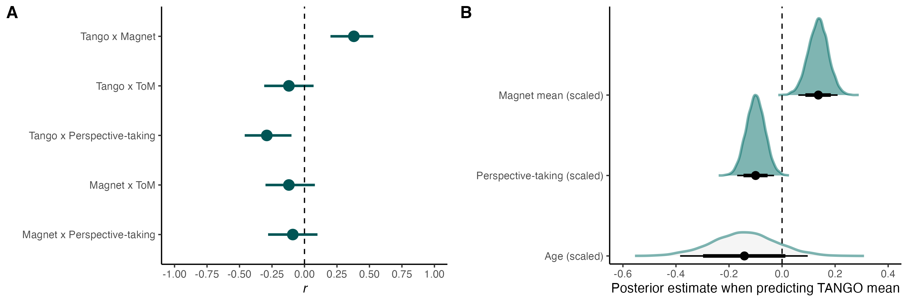

```{r setup, include = FALSE}
library("tidyverse")
library("papaja")
library("kableExtra")

theme_set(theme_classic())
```

```{r analysis_preferences}
# Seed for random number generation
set.seed(42)
knitr::opts_chunk$set(cache.extra = knitr::rand_seed)
```

# Introduction

-   why do we care about developmental trajectory? ref to stat learning paper
-   variation

## Why do we need gaze understanding?

How do humans learn about their environment and navigate through their social surroundings? One possibility to extract information from the environment is through following others' focus of attention. Building a common ground is considered especially important in communicative interactions and shared activities [@tomasello2007reliance].

## How does gaze following emerge?

Existing studies operationalize gaze following as the ability to follow another agent's line of sight. As one of the most fundamental social-cognitive abilities, it has been extensively studied in infancy and early childhood. Infants as young as six months can attune their gaze to that of another agent [@dentremont1997demonstration]. At the end of their first year of life, infants can follow gaze to locations outside their current visual field and move themselves to gain proper perceptual access [@moll200412].

While the emergence of gaze following has been well established, less is known about the developmental trajectory throughout childhood and adolescence. One possibility is that our social-cognitive ability in question is fully developed once emerged in infancy.However, many cognitive abilities develop with age [e.g., working memory, @gathercole2004structure]. Similarly, visual processing appears to improve with age. Therefore, children could potentially improve in gaze following, fine-tuning the performance of the already existing skill.

## The scope of infants' gaze following ability

Though these studies suggest that young infants can align their visual attention to another's line of sight, it does not necessarily include understanding the intentions of the other agent. Infants could simply attune their orientation or be attracted by others' gaze without processing what exactly the other is seeing (cf. Butterworth & Jarrett's ecological and geometric mechanism, @butterworth1991minds]. Therefore, it is crucial to study children's intentional understanding of gaze.

@moore1997role showed that 9-month-olds followed an agent's gaze more, when it was accompanied by a dynamic head turn in comparison to a static head turn.

In a hiding game with two search locations, @povinelli1997exploitation found that three-year-olds used gaze as a cue to locate the reward, while two-year-olds performed at chance level.

In a similar object choice paradigm with two containers, @behne2005oneyearolds investigated whether infants understand the communicative intent behind pointing and gaze cues. In contrast to @povinelli1997exploitation, they found that already 14-month-olds used the agent's cues to select an object. In conditions with absent-minded 'cues', infants performed around chance. This could be interpreted as infants recognizing the nature of this joint activity: namely, that the adult's behavior was beneficial and relevant for their object choice.

### Head vs eye direction

It is important to note that in many existing gaze conditions, the experimenter shifted their eyes and head in synchrony (e.g., [@povinelli1997exploitation, @behne2005oneyearolds]). Instead of pointing towards gaze understanding, a critic could claim that the results can be explained by face direction alone.

A handful of studies approached this potential confound by separately manipulating head and eye movement. @brooks2002importance implemented a comparison between eye and head orientation and found that 14-month-olds were sensitive to open versus closed eyes.

Investigating the 'cooperative eye hypothesis', @tomasello2007reliance implemented six conditions, in which an experimenter oriented towards the ceiling with their eyes only, head only (eyes closed), both head and eyes, or neither. They found that human infants relied more on the eye movement, while chimpanzees paid more attention to the head movement.

Importantly, the subjects were not presented with an object choice but their attention orientation was measured.

-   [@raviv2018developmental]

-   [@astor2022gaze]

-   [@colombo2001development]

-   [@scaife1975capacity]

-   [@itakura1998use]

-   [@carpenter1998social] "Several other studies have attempted to determine more precisely the cue that infants are using when they follow the gaze direction of others, that is, whether they use adults' head or eye orientation. In tasks comparing infants' responses when the experimenters turned their head and eyes together to targets with their responses when the experimenters directed their eyes to the targets but their head remained facing forward, Corkum and Moore (1995), Lempers (1979), and Lempers, Flavell, and Flavell (1977) all found that only infants age 12 months and older responded correctly when eyes and head were oriented in the same direction and that infants at all ages (i.e., through 19 months) performed poorly when eye and head direction diverged" (p.10-11) object choice.

-   [@silverstein2021infants] for vertical plane

-   [@zhang2019role]

-   [@frischen2007gaze]

-   [@lee1998children]

-   [@coelho2006searching]

## Aim of the current project

### Developmental trajectory, measuring & modeling individual differences

In this study, we were interested in the developmental trajectory of gaze understanding. While we expect the younger children to be able to follow gaze, we aimed at assessing the differentiation of their social-cognitive ability. Our goal was *not* to establish the youngest age at which children understand gaze cues. Rather, we wanted to examine how that ability changes with age.

In our study, we focused on the communicative intents of gaze: we asked children to locate a target by following an agent's gaze. While language demands were kept low, the participants had to actively respond and, therefore, make use of the presented gaze cue.

A unique contribution of this study is the richness of the data set. Methodological challenges arise when trying to compare data across ages from qualitatively and quantitatively different study tasks. We could circumvent these issues by applying the exact same task for the entire life span.

# Lifespan

-   development & individual differences in gaze understanding
-   verweis methods paper reliable differences kinder & adults.
-   kontinuerliche, systematische variation, wodrin? =\> model

<https://osf.io/6yjz3>

```{r lifespan_sample, include = T, out.width = "100%"}
lifespan_sample <- readRDS("../saves/lifespan_sample.rds")

lifespan_table <- lifespan_sample %>% 
  mutate(
    n = str_glue_data(., "{n_total} ({n_females} female)"), 
    `Age range` = str_glue_data(., "{age_min} - {age_max}"), 
  ) %>% 
  rename(
    `Age group` = age_group,
    `Age SD` = age_sd, 
    `Age mean` = age_mean
  ) %>% 
  select(`Age group`, n, `Age mean`, `Age range`, `Age SD`)

apa_table(lifespan_table)
```

## Participants

We collected data from a remote child, teenager and adult sample. For the remote child and teenager sample, we recruited participants via an internal database consisting of families living in Leipzig, Germany, who volunteered to participate in child development studies and indicated an interest in online studies.

The remote child and teenager sample consisted of `r sum(lifespan_sample$n_total[lifespan_sample$age_group < 18])` children, including `r lifespan_sample$n_total[lifespan_sample$age_group == "3"]` 3-year-olds (mean = `r lifespan_sample$age_mean[lifespan_sample$age_group == "3"]` years, SD = `r lifespan_sample$age_sd[lifespan_sample$age_group == "3"]`, range = `r lifespan_sample$age_min[lifespan_sample$age_group == "3"]` - `r lifespan_sample$age_max[lifespan_sample$age_group == "3"]`, `r lifespan_sample$n_females[lifespan_sample$age_group == "3"]` girls), `r lifespan_sample$n_total[lifespan_sample$age_group == "4"]` 4-year-olds (mean = `r lifespan_sample$age_mean[lifespan_sample$age_group == "4"]` years, SD = `r lifespan_sample$age_sd[lifespan_sample$age_group == "4"]`, range = `r lifespan_sample$age_min[lifespan_sample$age_group == "4"]` - `r lifespan_sample$age_max[lifespan_sample$age_group == "4"]`, `r lifespan_sample$n_females[lifespan_sample$age_group == "4"]` girls), `r lifespan_sample$n_total[lifespan_sample$age_group == "5"]` 5-year-olds (mean = `r lifespan_sample$age_mean[lifespan_sample$age_group == "5"]` years, SD = `r lifespan_sample$age_sd[lifespan_sample$age_group == "5"]`, range = `r lifespan_sample$age_min[lifespan_sample$age_group == "5"]` - `r lifespan_sample$age_max[lifespan_sample$age_group == "5"]`, `r lifespan_sample$n_females[lifespan_sample$age_group == "5"]` girls), `r lifespan_sample$n_total[lifespan_sample$age_group == "6"]` 6-year-olds (mean = `r lifespan_sample$age_mean[lifespan_sample$age_group == "6"]` years, SD = `r lifespan_sample$age_sd[lifespan_sample$age_group == "6"]`, range = `r lifespan_sample$age_min[lifespan_sample$age_group == "6"]` - `r lifespan_sample$age_max[lifespan_sample$age_group == "6"]`, `r lifespan_sample$n_females[lifespan_sample$age_group == "6"]` girls), `r lifespan_sample$n_total[lifespan_sample$age_group == "7"]` 7-year-olds (mean = `r lifespan_sample$age_mean[lifespan_sample$age_group == "7"]` years, SD = `r lifespan_sample$age_sd[lifespan_sample$age_group == "7"]`, range = `r lifespan_sample$age_min[lifespan_sample$age_group == "7"]` - `r lifespan_sample$age_max[lifespan_sample$age_group == "7"]`, `r lifespan_sample$n_females[lifespan_sample$age_group == "7"]` girls), `r lifespan_sample$n_total[lifespan_sample$age_group == "8"]` 8-year-olds (mean = `r lifespan_sample$age_mean[lifespan_sample$age_group == "8"]` years, SD = `r lifespan_sample$age_sd[lifespan_sample$age_group == "8"]`, range = `r lifespan_sample$age_min[lifespan_sample$age_group == "8"]` - `r lifespan_sample$age_max[lifespan_sample$age_group == "8"]`, `r lifespan_sample$n_females[lifespan_sample$age_group == "8"]` girls), `r lifespan_sample$n_total[lifespan_sample$age_group == "9"]` 9-year-olds (mean = `r lifespan_sample$age_mean[lifespan_sample$age_group == "9"]` years, SD = `r lifespan_sample$age_sd[lifespan_sample$age_group == "9"]`, range = `r lifespan_sample$age_min[lifespan_sample$age_group == "9"]` - `r lifespan_sample$age_max[lifespan_sample$age_group == "9"]`, `r lifespan_sample$n_females[lifespan_sample$age_group == "9"]` girls), `r lifespan_sample$n_total[lifespan_sample$age_group == "10"]` 10-year-olds (mean = `r lifespan_sample$age_mean[lifespan_sample$age_group == "10"]` years, SD = `r lifespan_sample$age_sd[lifespan_sample$age_group == "10"]`, range = `r lifespan_sample$age_min[lifespan_sample$age_group == "10"]` - `r lifespan_sample$age_max[lifespan_sample$age_group == "10"]`, `r lifespan_sample$n_females[lifespan_sample$age_group == "10"]` girls), `r lifespan_sample$n_total[lifespan_sample$age_group == "11"]` 11-year-olds (mean = `r lifespan_sample$age_mean[lifespan_sample$age_group == "11"]` years, SD = `r lifespan_sample$age_sd[lifespan_sample$age_group == "11"]`, range = `r lifespan_sample$age_min[lifespan_sample$age_group == "11"]` - `r lifespan_sample$age_max[lifespan_sample$age_group == "11"]`, `r lifespan_sample$n_females[lifespan_sample$age_group == "11"]` girls), `r lifespan_sample$n_total[lifespan_sample$age_group == "12"]` 12-year-olds (mean = `r lifespan_sample$age_mean[lifespan_sample$age_group == "12"]` years, SD = `r lifespan_sample$age_sd[lifespan_sample$age_group == "12"]`, range = `r lifespan_sample$age_min[lifespan_sample$age_group == "12"]` - `r lifespan_sample$age_max[lifespan_sample$age_group == "12"]`, `r lifespan_sample$n_females[lifespan_sample$age_group == "12"]` girls), `r lifespan_sample$n_total[lifespan_sample$age_group == "13"]` 13-year-olds (mean = `r lifespan_sample$age_mean[lifespan_sample$age_group == "13"]` years, SD = `r lifespan_sample$age_sd[lifespan_sample$age_group == "13"]`, range = `r lifespan_sample$age_min[lifespan_sample$age_group == "13"]` - `r lifespan_sample$age_max[lifespan_sample$age_group == "13"]`, `r lifespan_sample$n_females[lifespan_sample$age_group == "13"]` girls), `r lifespan_sample$n_total[lifespan_sample$age_group == "14"]` 14-year-olds (mean = `r lifespan_sample$age_mean[lifespan_sample$age_group == "14"]` years, SD = `r lifespan_sample$age_sd[lifespan_sample$age_group == "14"]`, range = `r lifespan_sample$age_min[lifespan_sample$age_group == "14"]` - `r lifespan_sample$age_max[lifespan_sample$age_group == "14"]`, `r lifespan_sample$n_females[lifespan_sample$age_group == "14"]` girls), `r lifespan_sample$n_total[lifespan_sample$age_group == "15"]` 15-year-olds (mean = `r lifespan_sample$age_mean[lifespan_sample$age_group == "15"]` years, SD = `r lifespan_sample$age_sd[lifespan_sample$age_group == "15"]`, range = `r lifespan_sample$age_min[lifespan_sample$age_group == "15"]` - `r lifespan_sample$age_max[lifespan_sample$age_group == "15"]`, `r lifespan_sample$n_females[lifespan_sample$age_group == "15"]` girls), `r lifespan_sample$n_total[lifespan_sample$age_group == "16"]` 16-year-olds (mean = `r lifespan_sample$age_mean[lifespan_sample$age_group == "16"]` years, SD = `r lifespan_sample$age_sd[lifespan_sample$age_group == "16"]`, range = `r lifespan_sample$age_min[lifespan_sample$age_group == "16"]` - `r lifespan_sample$age_max[lifespan_sample$age_group == "16"]`, `r lifespan_sample$n_females[lifespan_sample$age_group == "16"]` girls), `r lifespan_sample$n_total[lifespan_sample$age_group == "17"]` 17-year-olds (mean = `r lifespan_sample$age_mean[lifespan_sample$age_group == "17"]` years, SD = `r lifespan_sample$age_sd[lifespan_sample$age_group == "17"]`, range = `r lifespan_sample$age_min[lifespan_sample$age_group == "17"]` - `r lifespan_sample$age_max[lifespan_sample$age_group == "17"]`, `r lifespan_sample$n_females[lifespan_sample$age_group == "17"]` girls), `r lifespan_sample$n_total[lifespan_sample$age_group == "18"]` 17-year-olds (mean = `r lifespan_sample$age_mean[lifespan_sample$age_group == "18"]` years, SD = `r lifespan_sample$age_sd[lifespan_sample$age_group == "18"]`, range = `r lifespan_sample$age_min[lifespan_sample$age_group == "18"]` - `r lifespan_sample$age_max[lifespan_sample$age_group == "18"]`, `r lifespan_sample$n_females[lifespan_sample$age_group == "18"]` girls), `r lifespan_sample$n_total[lifespan_sample$age_group == "19"]` 17-year-olds (mean = `r lifespan_sample$age_mean[lifespan_sample$age_group == "19"]` years, SD = `r lifespan_sample$age_sd[lifespan_sample$age_group == "19"]`, range = `r lifespan_sample$age_min[lifespan_sample$age_group == "19"]` - `r lifespan_sample$age_max[lifespan_sample$age_group == "19"]`, `r lifespan_sample$n_females[lifespan_sample$age_group == "19"]` girls).

Children and teenagers in our sample grow up in an industrialized, urban Central-European context. Information on socioeconomic status was not formally recorded, although the majority of families come from mixed, mainly mid to high socioeconomic backgrounds with high levels of parental education.

Adults were recruited via *Prolific* [@palan2018prolific]. *Prolific* is an online participant recruitment service from the University of Oxford with a predominantly European and US-American subject pool. Participants consisted of `r sum(lifespan_sample$n_total[lifespan_sample$age_group >= 20])` English-speaking adults that reported to have normal or corrected-to-normal vision. The sample included `r lifespan_sample$n_total[lifespan_sample$age_group == "20"]` 20- to 29-year-olds (mean = `r lifespan_sample$age_mean[lifespan_sample$age_group == "20"]` years, SD = `r lifespan_sample$age_sd[lifespan_sample$age_group == "20"]`, range = `r lifespan_sample$age_min[lifespan_sample$age_group == "20"]` - `r lifespan_sample$age_max[lifespan_sample$age_group == "20"]`, `r lifespan_sample$n_females[lifespan_sample$age_group == "20"]` female), `r lifespan_sample$n_total[lifespan_sample$age_group == "30"]` 30- to 39-year-olds (mean = `r lifespan_sample$age_mean[lifespan_sample$age_group == "30"]` years, SD = `r lifespan_sample$age_sd[lifespan_sample$age_group == "30"]`, range = `r lifespan_sample$age_min[lifespan_sample$age_group == "30"]` - `r lifespan_sample$age_max[lifespan_sample$age_group == "30"]`, `r lifespan_sample$n_females[lifespan_sample$age_group == "30"]` female), `r lifespan_sample$n_total[lifespan_sample$age_group == "40"]` 40- to 49-year-olds (mean = `r lifespan_sample$age_mean[lifespan_sample$age_group == "40"]` years, SD = `r lifespan_sample$age_sd[lifespan_sample$age_group == "40"]`, range = `r lifespan_sample$age_min[lifespan_sample$age_group == "40"]` - `r lifespan_sample$age_max[lifespan_sample$age_group == "40"]`, `r lifespan_sample$n_females[lifespan_sample$age_group == "40"]` female), `r lifespan_sample$n_total[lifespan_sample$age_group == "50"]` 50- to 59-year-olds (mean = `r lifespan_sample$age_mean[lifespan_sample$age_group == "50"]` years, SD = `r lifespan_sample$age_sd[lifespan_sample$age_group == "50"]`, range = `r lifespan_sample$age_min[lifespan_sample$age_group == "50"]` - `r lifespan_sample$age_max[lifespan_sample$age_group == "50"]`, `r lifespan_sample$n_females[lifespan_sample$age_group == "50"]` female), `r lifespan_sample$n_total[lifespan_sample$age_group == "60"]` 60- to 69-year-olds (mean = `r lifespan_sample$age_mean[lifespan_sample$age_group == "60"]` years, SD = `r lifespan_sample$age_sd[lifespan_sample$age_group == "60"]`, range = `r lifespan_sample$age_min[lifespan_sample$age_group == "60"]` - `r lifespan_sample$age_max[lifespan_sample$age_group == "60"]`, `r lifespan_sample$n_females[lifespan_sample$age_group == "60"]` female), and `r lifespan_sample$n_total[lifespan_sample$age_group == "70"]` 70- to 79-year-olds (mean = `r lifespan_sample$age_mean[lifespan_sample$age_group == "70"]` years, SD = `r lifespan_sample$age_sd[lifespan_sample$age_group == "70"]`, range = `r lifespan_sample$age_min[lifespan_sample$age_group == "70"]` - `r lifespan_sample$age_max[lifespan_sample$age_group == "70"]`, `r lifespan_sample$n_females[lifespan_sample$age_group == "70"]` female).

For completing the study, subjects were paid above the fixed minimum wage (on average £10.00 per hour; see Supplements for further detail).

## Materials

We used the continuous version of the TANGO [@prein2022tango]. The task was presented as an interactive web application (see Figure \@ref(fig:fig1); live demo [https://ccp-odc.eva.mpg.de/tango-demo/](https://ccp-odc.eva.mpg.de/tango-demo/.); source code <https://github.com/ccp-eva/tango-demo>). The TANGO showed satisfactory internal consistency and retest reliability [with reliability estimates *Pearson's r* ranging from .7 to .8 for the continuous task version; @prein2022tango].

Each trial presented an agent standing in a window, watching a balloon (*i.e.*, target) falling to the ground. The target then fell behind a hedge (continuous task version). The agent's gaze followed the target's trajectory: pupil and iris moved so that their center aligned with the target center. In test trials, the target flight was covered so that participants could not see where the target landed. Participants' task was to locate the target by tracking the agent's gaze. They could respond by touching on the screen.

Four familiarization trials ensured that participants understood the task and felt comfortable with the response format. Then, 15 test trials followed. Completing the 19 trials took approximately 5-10 minutes.

The outcome measure was imprecision, defined as the absolute difference between the target center and the x coordinate of the participant's click. Target coordinates were randomly generated during runtime. Each target bin, as well as all agents and target colors, occurred equally often and and did not appear in more than two consecutive trials.

(ref:figlab1) **Setup of the TANGO and Magnet tasks**. (A) TANGO: Gaze understanding task. The agent stands in a window with the target in front of them. A hedge grows and covers the target. The target falls to a random location on the ground. The agent's eyes track the movement of the target. (B) Magnet task: non-social vector estimation.

```{r fig1, include = T, out.width = "100%", fig.align = "center", fig.cap = "(ref:figlab1)"}

```

## Procedure

Children and teenagers received a personalized link to the study website. Caregivers were asked to provide technical support whenever needed, while explicitly being reminded to not help their children in responding. Webcam videos were recorded whenever consented and technically feasible, in order to monitor whether children and teenagers responded on their own.

## Analysis

All test trials without voice-over description were included in our analyses. We ran all analyses in `r R.version$version.string` [@rcoreteam2022language]. Regression models were fit as Bayesian generalized linear mixed models (GLMMs) with default priors for all analyses, using the function `brm` from the package `brms` [@burkner2017brms; @burkner2018advanced].

To estimate the developmental trajectory of gaze understanding and the effect of data collection mode, we fit a GLMM predicting the task performance in each trial by age (in months, z-transformed) and data collection mode (reference category: in-person supervised). The model included random intercepts for each participant and each target position, and a random slope for symmetric target position within participants (model notation in `R: performance ~ age + datacollection + (symmetricPosition | subjID) + (1 | targetPosition)`). Here, `targetPosition` refers to the exact bin/box of the target, while `symmetricPosition` refers to the absolute distance from the stimulus center (i.e., smaller value meaning more central target position). We expected that trials could differ in their difficulty depending on the target centrality and that these item effects could vary between participants.

For the hedge version, performance was defined as the absolute click distance between the target center and the click X coordinate, scaled according to target widths, and modeled by a `lognormal` distribution. For the box version, the model predicted correct responses (0/1) using a `Bernoulli` distribution with a logit link function. We inspected the posterior distribution (mean and 95% Confidence Interval (CI)) for the age and data collection estimates.

## Results

(ref:figlab2) **Differentiation in gaze understanding**. Performance is measured as imprecision, i.e., the absolute distance between the target's center and the participant's click (averaged across trials). The unit of imprecision is counted in the width of the target, i.e., a participant with imprecision of 1 clicked on average one target width to the left or right of the true target center.

```{r fig2, include = T, out.width = "100%", fig.align = "center", fig.cap = "(ref:figlab2)"}
knitr::include_graphics(c("../figures/lifespan_plot.png"))
```

## Discussion

Three-year-olds were surprisingly inaccurate in their responses. One possible explanation could be that they simply lacked the ability to complete the task, potentially due to issues in gaze following. Contrasting our results with previous findings on infant gaze following, this explanation is unlikely. A more likely explanation would be that children were able to follow the agent's gaze but struggled to translate this implicit understanding into active behavior.

Another point to keep in mind is that we used subtle eye movements as cues. Many existing studies let the agents move eye and head in parallel, therefore establishing a confound with greater (head) movement. Relying exclusively on the eye movement might be trickier for children than when presented with a combined eye and head orientation.

The performance of the youngest children seems more consistent with performance demands than with a failure in gaze following.

# Computational cognitive model

-   model auch für warum ältere Erwachsene schlecht? anders schlecht als kinder?
-   entwicklungsperspektive basierend auf model
-   dann prozess-ebene = magnet

```{r gazemodel_sample}
gazemodel_sample <- readRDS("../saves/gazemodel_sample.rds")
```

## Participants

The sample included the `r sum(gazemodel_sample$n_total[gazemodel_sample$age_group < 6])` three- to five-year-old children and `r sum(gazemodel_sample$n_total[gazemodel_sample$age_group == 18])` adults from our Lifespan study. For age distributions, see Participant section of the Lifespan Study.

out of convenience, we only used ... since developmental chnage was minimial in adutls we used ...

## Procedure

## Analysis

## Results

(ref:figlab3) **Gaze funnel**

```{r fig3, include = T, out.width = "100%", fig.align = "center", fig.cap = "(ref:figlab3)"}

```

## Discussion

# Components of gaze understanding

Our computational cognitive model assumes that the ability to engage in vector estimation is a crucial component of mastering gaze understanding. In this study, we sought to inquire whether there are any other cognitive processes outside vector-following that constitute gaze understanding. We aimed to assess whether there are exclusively task-specific processes at hand or whether gaze understanding recruits a general social-cognitive ability that is shared among other social-cognitive tasks.

First, we aimed at isolating the vector-following part of the gaze understanding task. For this, we designed a new non-social vector estimation task that shared all crucial design features of the understanding task. Additionally, we administered a ToM task battery, comprising 4 tasks from the ToM scale by Wellman and Liu (2004) and two additional perspective-taking tasks.

Our reasoning was that the gaze understanding task shares task demands with the non-social vector estimation task, while it shares its social context with the ToM tasks. This way, we can disentangle which components comprise gaze understanding. In this way, we can find out what contribution each component makes to explain gaze understanding.

Task design, data collection, and sample sizes were pre-registered: <https://osf.io/xsqkt>. The study design and procedure obtained ethical clearance by the MPG Ethics commission Munich, Germany, falling under a packaged ethics application (Appl. No. 2021_45), and was approved by an internal ethics committee at the Max Planck Institute for Evolutionary Anthropology. The research adheres to the legal requirements of psychological research with children in Germany. Data were collected between February and March 2023.

## Participants

```{r magnet_sample}
magnet_sample <- readRDS("../saves/magnet_sample.rds")
```

Testing took place in kindergartens in Leipzig, Germany. The sample consisted of `r magnet_sample$n_total` children (mean age = `r magnet_sample$age_mean` years, SD = `r sum(magnet_sample$age_sd)`, range = `r magnet_sample$age_min` - `r magnet_sample$age_max`, `r magnet_sample$n_females` girls).

## Procedure

Children were tested in a quiet room in their kindergarten. An experimenter guided the child through the study. Since our research questions related to individual differences and we wanted maximum control of extraneous participant variables, we employed a within-subjects design. All participants performed the following tasks in a fixed order: (1) non-social vector estimation task, (2) ToM task battery, (3) gaze understanding task. Several reasons motivated the decision. First, we decided for a fixed order to be able to compare participant's performance straight-forwardly with each other. Second, to increase participant engagement and decrease fatigue or fuzziness, we switched from a tablet task, to tasks with personal interaction, back to a tablet task. Third, we showed the non-social vector estimation task before the gaze understanding task, so that participants would not be biased to interpret the presented stimuli as "eye- / "agent-like".

### Non-social vector estimation

Modeling the setup and structure of the previously applied gaze understanding task, we designed a non-social vector estimation task. This task was also presented as a webapp and made use of the concept of magnetism. The setup looked as follows. On the upper part of the screen, there was a tube with a gearwheel, located in a circular window. On the floor, there laid a magnet. The magnet then got switched on (making a cartoon-like sound), whereupon the gearwheel moved towards the magnet. The gearwheel moved in a way that its center aligned with the center of the magnet. Participants were then asked to locate the magnet. Access to the magnet's true location was manipulated by a wooden wall: participants either had full, partial, or no visual access to the true magnet location. When no information about the magnet location was accessible, participants were expected to use the gearwheel inside the window as a non-social cue to locate the magnet.

As in the TANGO, there were three different trial types depending on the visual access to the true magnet location. In the touch training, participants had full visual access to the magnet's location (i.e., no wooden wall). In familiarization trials, participants had partial visual access, since the wooden wall was moved in front of the target after the magnet's location was already visible. In test trials, participants have no visual access to the magnet location, because the wall covers the magnet from the beginning of the trial.

Children received 19 trials with one touch training, two familiarization trials, and 16 test trials each. The first trial of each type comprised a voice-over description of the presented events. We conducted our analysis with 15 test trials, excluding the touch, familiarization, and voice-over trials. The outcome variable was imprecision, defined as the absolute difference between the magnet's x coordinate and the x coordinate of the participant's click. Magnet coordinates were generated as follows. The full width of the screen was divided into ten bins. Each bin occurred equally often, while the same bin could occur in two consecutive trials. Exact coordinates within each bin were randomly generated.

### Theory of Mind task battery

We administered four tasks from the @wellman2004scaling Theory of Mind scale. We excluded three tasks: the Diverse Desires task in order to avoid ceiling effects; and both tasks involving emotions (Belief Emotion and Real-Apparent Emotion), as we aimed at assessing the "cold, cognitive" (as compared to the "emotional") aspects of social cognition. Instead, we added two perspective-taking level-2 tasks [@flavell1981development; @flavell1981younga], with the aim of increasing the task battery's difficulty. See Supplements for further detail. The dependent variable was the aggregate score of all solved ToM tasks. In an exploratory analysis, we investigated if gaze understanding was more strongly associated with the two perspective-taking tasks compared to the other ToM tasks, as perspective-taking seems most closely theoretically related to gaze understanding (i.e., in both cases the participant is asked to judge another person's point of view).

### Gaze understanding

As in the two previously reported studies, we presented children with the continuous version of the TANGO [@prein2022tango]. Children were tested on a tablet.

## Analysis

By design, both the gaze understanding task as well as the non-social vector estimation task involve vector estimation. On the basis of the results from our computational cognitive model, we expected that children's performance in both tasks correlate significantly. For these two tasks, we calculated the mean level of imprecision for each subject. We correlated these two scores using *Pearson's* correlation coefficients.

Regarding the relationship between the two vector estimation tasks and the ToM measures, we can imagine two possible scenarios: (A) If gaze understanding recruits a general social-cognitive ability beyond vector estimation, we expect that gaze understanding and ToM measures are more strongly correlated than non-social vector estimation and ToM measures. (B) If gaze understanding relies purely on task-specific processes, then the correlation between gaze understanding and ToM measures will be comparable to the correlation between non-social vector estimation and the ToM measures. For the association between the aggregate ToM scores and the gaze understanding / non-social vector estimation tasks, we used *Spearman's* rank correlation coefficient.

Furthermore, to estimate which components contribute to gaze understanding, we conducted a model comparison with GLMMs predicting the mean imprecision in gaze understanding by age, non-social vector estimation, the ToM aggregate score, or the aggregate of the two perspective-taking tasks (subset of ToM battery; example of model notation in\`R: tango_mean \~ age_centered + magnet_scaled + perspective_scaled\`). The outcome variable was modeled by a lognormal distribution. With this analysis, we wanted to assess whether the ToM aggregate score or the singled-out perspective-taking score added additional explanatory value.

## Results

As expected, we found that gaze understanding as a social vector estimation task correlated with the non-social vector estimation task. Importantly, however, the two vector estimation tasks were not redundant: only a part of the variance in gaze understanding could be explained by non-social vector estimation.

Our model comparison corroborated this: evidently, gaze understanding was best predicted by non-social vector estimation and perspective-taking. This shows that the gaze understanding task recruits social-cognitive abilities beyond vector estimation.

(ref:figlab4) **Components of gaze understanding**

```{r fig4, include = T, out.width = "100%", fig.align = "center", fig.cap = "(ref:figlab4)"}

```

## Discussion

In previous work, we could establish that the TANGO is suited as an individual differences measure [@prein2022tango]. Capturing meaningful variability in performance is a crucial task feature when we are interested in revealing the relationship between different cognitive abilities.

It seems noteworthy to point out that lower correlations between ToM skills and gaze understanding could be grounded in the design features of the applied ToM tasks. The tasks we used to measure ToM skills were not designed to capture individual differences: they rely on an aggregate score of dichotomous measures. These sum scores can only capture limited variance, which may obscure potential correlations. However, since these tasks are the gold standard in the social-cognitive literature and continuous measures with satisfying psychometric properties are, to the best of our knowledge, still scarce, we nonetheless relied on them in this study. The development of new measures to capture individual differences in social-cognitive abilities like false-belief understanding seems desirable and essential to move this line of research further.

# General discussion

# Limitations

# Conclusion

\newpage

# Declarations

## Open practices statement

The web application (<https://ccp-odc.eva.mpg.de/tango-demo/>) described here is open source (<https://github.com/ccp-eva/tango-demo>). The data sets generated during and/or analysed during the current study are available in the [gazecues-modeling] repository (<https://github.com/ccp-eva/gazecues-modeling>). All experiments were pre-registered (<https://osf.io/zjhsc/>).

## Funding

This study was funded by the Max Planck Society for the Advancement of Science, a noncommercial, publicly financed scientific organization (no grant number). We thank all the children, caregivers, and adults who participated in the study. We thank Jana Jurkat for her help with data collection.

## Conflicts of interest

The authors declare that they have no conflict of interest.

## Consent to participate

Informed consent was obtained from all individual participants included in the study or their legal guardians.

## Authors' contributions

The authors made the following contributions: \### TODO

\newpage

# References

```{=tex}
\begingroup
\setlength{\parindent}{-0.5in}
\setlength{\leftskip}{0.5in}
```
::: {#refs custom-style="Bibliography"}
:::

```{=tex}
\endgroup
```
\newpage
