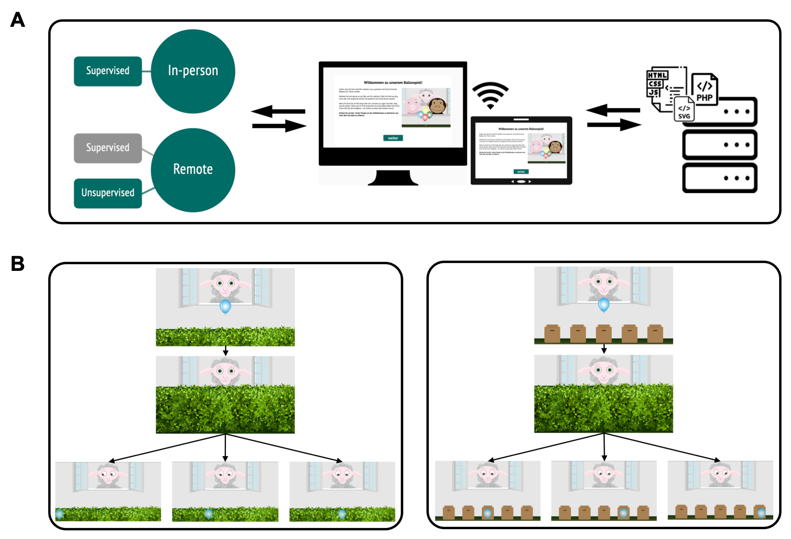

```{r setup, include = FALSE}
library("papaja")
library("ggplot2")
library("ggpubr")
library("tidyverse")
library("brms")
theme_set(theme_classic())
```

```{r analysis-preferences}
# Seed for random number generation
set.seed(42)
knitr::opts_chunk$set(cache.extra = knitr::rand_seed)
```

```{r load_data}
# TODO: only hedge version

testtrials <- readRDS(file = "../data/tango-testtrials.rds") %>%
  mutate_if(is.character, as.factor) %>% 
  # determine order of factors
  mutate(
    targetPosition = factor(targetPosition, levels = c("1", "2", "3", "4", "5", "6", "7", "8", "9", "10")),
    datacollection = factor(datacollection, levels = c("in-person - supervised", "remote - unsupervised")),
    sample = factor(sample, levels = c("kids", "teens", "adults")),
    studytype = factor(studytype, levels = c("vali", "reli")),

    # for models, summarize targetPositions in a way that it's symmetrical for left/ right side
    # the smaller the value, the more central the position
    symmetricPosition = case_when(
                                  targetPosition == "5" | targetPosition == "6" ~ 1,
                                  targetPosition == "4" | targetPosition == "7" ~ 2,
                                  targetPosition == "3" | targetPosition == "8" ~ 3,
                                  targetPosition == "2" | targetPosition == "9" ~ 4,
                                  targetPosition == "1" | targetPosition == "10" ~ 5,
                       ),

    # distance between target and click in balloon widths (balloon width is 160 SVG units)
    clickDistInBalloons = abs(clickDistFromTargetCenterX)/160,
  )
```

# Introduction
- why do we care about developmental trajectory? ref to stat learning paper
- variation 

## Why do we need gaze understanding?

How do humans learn about their environment and navigate through their social surroundings? One possibility to extract information from the environment is through following others' focus of attention. Building a common ground is considered especially important in communicative interactions and shared activities [@tomasello2007reliance].

## How does gaze following emerge?

Existing studies operationalize gaze following as the ability to follow another agent's line of sight. As one of the most fundamental social-cognitive abilities, it has been extensively studied in infancy and early childhood. Infants as young as six months can attune their gaze to that of another agent [@dentremont1997demonstration]. At the end of their first year of life, infants can follow gaze to locations outside their current visual field and move themselves to gain proper perceptual access [@moll200412].

While the emergence of gaze following has been well established, less is known about the developmental trajectory throughout childhood and adolescence. One possibility is that our social-cognitive ability in question is fully developed once emerged in infancy.However, many cognitive abilities develop with age [e.g., working memory, @gathercole2004structure]. Similarly, visual processing appears to improve with age. Therefore, children could potentially improve in gaze following, fine-tuning the performance of the already existing skill.

## The scope of infants' gaze following ability

Though these studies suggest that young infants can align their visual attention to another's line of sight, it does not necessarily include understanding the intentions of the other agent. Infants could simply attune their orientation or be attracted by others' gaze without processing what exactly the other is seeing (cf. Butterworth & Jarrett's ecological and geometric mechanism, @butterworth1991minds]. Therefore, it is crucial to study children's intentional understanding of gaze. 

@moore1997role showed that 9-month-olds followed an agent's gaze more, when it was accompanied by a dynamic head turn in comparison to a static head turn.

In a hiding game with two search locations, @povinelli1997exploitation found that three-year-olds used gaze as a cue to locate the reward, while two-year-olds performed at chance level.

In a similar object choice paradigm with two containers, @behne2005oneyearolds investigated whether infants understand the communicative intent behind pointing and gaze cues. In contrast to @povinelli1997exploitation, they found that already 14-month-olds used the agent's cues to select an object. In conditions with absent-minded 'cues', infants performed around chance. This could be interpreted as infants recognizing the nature of this joint activity: namely, that the adult's behavior was beneficial and relevant for their object choice.

### Head vs eye direction

It is important to note that in many existing gaze conditions, the experimenter shifted their eyes and head in synchrony (e.g., [@povinelli1997exploitation, @behne2005oneyearolds]). Instead of pointing towards gaze understanding, a critic could claim that the results can be explained by face direction alone.

A handful of studies approached this potential confound by separately manipulating head and eye movement. @brooks2002importance implemented a comparison between eye and head orientation and found that 14-month-olds were sensitive to open versus closed eyes.

Investigating the 'cooperative eye hypothesis', @tomasello2007reliance implemented six conditions, in which an experimenter oriented towards the ceiling with their eyes only, head only (eyes closed), both head and eyes, or neither. They found that human infants relied more on the eye movement, while chimpanzees paid more attention to the head movement.

Importantly, the subjects were not presented with an object choice but their attention orientation was measured.

- [@raviv2018developmental]
- [@astor2022gaze]
- [@colombo2001development]
- [@scaife1975capacity]
- [@itakura1998use]

- [@carpenter1998social] "Several other studies have attempted to determine more precisely the cue that infants are using when they follow the gaze direction of others, that is, whether they use adults' head or eye orientation. In tasks comparing infants' responses when the experimenters turned their head and eyes together to targets with their responses when the experimenters directed their eyes to the targets but their head remained facing forward, Corkum and Moore (1995), Lempers (1979), and Lempers, Flavell, and Flavell (1977) all found that only infants age 12 months and older responded correctly when eyes and head were oriented in the same direction and that infants at all ages (i.e., through 19 months) performed poorly when eye and head direction diverged" (p.10-11) object choice.

- [@silverstein2021infants] for vertical plane
- [@zhang2019role]
- [@frischen2007gaze]
- [@lee1998children]
- [@coelho2006searching]

## Aim of the current project

### Developmental trajectory, measuring & modeling individual differences

In this study, we were interested in the developmental trajectory of gaze understanding. While we expect the younger children to be able to follow gaze, we aimed at assessing the differentiation of their social-cognitive ability. Our goal was *not* to establish the youngest age at which children understand gaze cues. Rather, we wanted to examine how that ability changes with age.

In our study, we focused on the communicative intents of gaze: we asked children to locate a target by following an agent's gaze. While language demands were kept low, the participants had to actively respond and, therefore, make use of the presented gaze cue.

A unique contribution of this study is the richness of the data set. Methodological challenges arise when trying to compare data across ages from qualitatively and quantitatively different study tasks. We could circumvent these issues by applying the exact same task for the entire life span.


# Lifespan 
- development & individual differences in gaze understanding
- verweis methods paper reliable differences kinder & adults. 
- kontinuerliche, systematische variation, wodrin? => model

```{r dev_sample}
dev_kids <- testtrials %>%
  filter(studytype == "vali" & age < 18) %>%
  group_by(datacollection, agegroup) %>%
  mutate(female = ifelse(gender == "f", 1, 0)) %>%
  summarise(
    nTotal = n_distinct(subjID),
    meanAge = mean(age, na.rm = T) %>% round(2),
    sdAge = sd(age, na.rm = T) %>% round(2),
    minAge = min(age, na.rm = T),
    maxAge = max(age, na.rm = T),
    nFemales = ceiling(sum(female/15)),
  )

dev_adults <- testtrials %>%
  filter(studytype == "vali" & sample == "adults") %>%
  ungroup() %>%
  mutate(
    gender = ifelse(is.na(gender), 0, paste(gender)),
    female = ifelse(gender == "f", 1, 0),
  ) %>%
  summarise(
    nTotal = n_distinct(subjID),
    meanAge = mean(age, na.rm = T) %>% round(2),
    sdAge = sd(age, na.rm = T) %>% round(2),
    minAge = min(age, na.rm = T),
    maxAge = max(age, na.rm = T),
    nFemales = ceiling(sum(female/15)),
  )
```

## Participants

We collected data from an in-person child sample, a remote child an teenager sample, and a remote adult sample. In-person testing with children took place in kindergartens in Leipzig, Germany.

The in-person child sample consisted of `r sum(dev_kids$nTotal[dev_kids$datacollection == "in-person - supervised"])` children, including `r sum(dev_kids$nTotal[dev_kids$datacollection == "in-person - supervised" & dev_kids$agegroup == "3"])` 3-year-olds (mean = `r sum(dev_kids$meanAge[dev_kids$datacollection == "in-person - supervised" & dev_kids$agegroup == "3"])` years, SD = `r sum(dev_kids$sdAge[dev_kids$datacollection == "in-person - supervised" & dev_kids$agegroup == "3"])`, range = `r sum(dev_kids$minAge[dev_kids$datacollection == "in-person - supervised" & dev_kids$agegroup == "3"])` - `r sum(dev_kids$maxAge[dev_kids$datacollection == "in-person - supervised" & dev_kids$agegroup == "3"])`, `r sum(dev_kids$nFemales[dev_kids$datacollection == "in-person - supervised" & dev_kids$agegroup == "3"])` girls), `r sum(dev_kids$nTotal[dev_kids$datacollection == "in-person - supervised" & dev_kids$agegroup == "4"])` 4-year-olds (mean = `r sum(dev_kids$meanAge[dev_kids$datacollection == "in-person - supervised" & dev_kids$agegroup == "4"])` years, SD = `r sum(dev_kids$sdAge[dev_kids$datacollection == "in-person - supervised" & dev_kids$agegroup == "4"])`, range = `r sum(dev_kids$minAge[dev_kids$datacollection == "in-person - supervised" & dev_kids$agegroup == "4"])` - `r sum(dev_kids$maxAge[dev_kids$datacollection == "in-person - supervised" & dev_kids$agegroup == "4"])`, `r sum(dev_kids$nFemales[dev_kids$datacollection == "in-person - supervised" & dev_kids$agegroup == "4"])` girls), and `r sum(dev_kids$nTotal[dev_kids$datacollection == "in-person - supervised" & dev_kids$agegroup == "5"])` 5-year-olds (mean = `r sum(dev_kids$meanAge[dev_kids$datacollection == "in-person - supervised" & dev_kids$agegroup == "5"])` years, SD = `r sum(dev_kids$sdAge[dev_kids$datacollection == "in-person - supervised" & dev_kids$agegroup == "5"])`, range = `r sum(dev_kids$minAge[dev_kids$datacollection == "in-person - supervised" & dev_kids$agegroup == "5"])` - `r sum(dev_kids$maxAge[dev_kids$datacollection == "in-person - supervised" & dev_kids$agegroup == "5"])`, `r sum(dev_kids$nFemales[dev_kids$datacollection == "in-person - supervised" & dev_kids$agegroup == "5"])` girls).

For the remote child and teenager sample, we recruited participants via an internal database consisting of families living in Leipzig, Germany, who volunteered to participate in child development studies and indicated an interest in online studies.

The remote child and teenager sample consisted of `r sum(dev_kids$nTotal[dev_kids$datacollection == "remote - unsupervised"])` children, including `r sum(dev_kids$nTotal[dev_kids$datacollection == "remote - unsupervised" & dev_kids$agegroup == "3"])` 3-year-olds (mean = `r sum(dev_kids$meanAge[dev_kids$datacollection == "remote - unsupervised" & dev_kids$agegroup == "3"])` years, SD = `r sum(dev_kids$sdAge[dev_kids$datacollection == "remote - unsupervised" & dev_kids$agegroup == "3"])`, range = `r sum(dev_kids$minAge[dev_kids$datacollection == "remote - unsupervised" & dev_kids$agegroup == "3"])` - `r sum(dev_kids$maxAge[dev_kids$datacollection == "remote - unsupervised" & dev_kids$agegroup == "3"])`, `r sum(dev_kids$nFemales[dev_kids$datacollection == "remote - unsupervised" & dev_kids$agegroup == "3"])` girls), `r sum(dev_kids$nTotal[dev_kids$datacollection == "remote - unsupervised" & dev_kids$agegroup == "4"])` 4-year-olds (mean = `r sum(dev_kids$meanAge[dev_kids$datacollection == "remote - unsupervised" & dev_kids$agegroup == "4"])` years, SD = `r sum(dev_kids$sdAge[dev_kids$datacollection == "remote - unsupervised" & dev_kids$agegroup == "4"])`, range = `r sum(dev_kids$minAge[dev_kids$datacollection == "remote - unsupervised" & dev_kids$agegroup == "4"])` - `r sum(dev_kids$maxAge[dev_kids$datacollection == "remote - unsupervised" & dev_kids$agegroup == "4"])`, `r sum(dev_kids$nFemales[dev_kids$datacollection == "remote - unsupervised" & dev_kids$agegroup == "4"])` girls), `r sum(dev_kids$nTotal[dev_kids$datacollection == "remote - unsupervised" & dev_kids$agegroup == "5"])` 5-year-olds (mean = `r sum(dev_kids$meanAge[dev_kids$datacollection == "remote - unsupervised" & dev_kids$agegroup == "5"])` years, SD = `r sum(dev_kids$sdAge[dev_kids$datacollection == "remote - unsupervised" & dev_kids$agegroup == "5"])`, range = `r sum(dev_kids$minAge[dev_kids$datacollection == "remote - unsupervised" & dev_kids$agegroup == "5"])` - `r sum(dev_kids$maxAge[dev_kids$datacollection == "remote - unsupervised" & dev_kids$agegroup == "5"])`, `r sum(dev_kids$nFemales[dev_kids$datacollection == "remote - unsupervised" & dev_kids$agegroup == "5"])` girls), `r sum(dev_kids$nTotal[dev_kids$datacollection == "remote - unsupervised" & dev_kids$agegroup == "6"])` 6-year-olds (mean = `r sum(dev_kids$meanAge[dev_kids$datacollection == "remote - unsupervised" & dev_kids$agegroup == "6"])` years, SD = `r sum(dev_kids$sdAge[dev_kids$datacollection == "remote - unsupervised" & dev_kids$agegroup == "6"])`, range = `r sum(dev_kids$minAge[dev_kids$datacollection == "remote - unsupervised" & dev_kids$agegroup == "6"])` - `r sum(dev_kids$maxAge[dev_kids$datacollection == "remote - unsupervised" & dev_kids$agegroup == "6"])`, `r sum(dev_kids$nFemales[dev_kids$datacollection == "remote - unsupervised" & dev_kids$agegroup == "6"])` girls), `r sum(dev_kids$nTotal[dev_kids$datacollection == "remote - unsupervised" & dev_kids$agegroup == "7"])` 7-year-olds (mean = `r sum(dev_kids$meanAge[dev_kids$datacollection == "remote - unsupervised" & dev_kids$agegroup == "7"])` years, SD = `r sum(dev_kids$sdAge[dev_kids$datacollection == "remote - unsupervised" & dev_kids$agegroup == "7"])`, range = `r sum(dev_kids$minAge[dev_kids$datacollection == "remote - unsupervised" & dev_kids$agegroup == "7"])` - `r sum(dev_kids$maxAge[dev_kids$datacollection == "remote - unsupervised" & dev_kids$agegroup == "7"])`, `r sum(dev_kids$nFemales[dev_kids$datacollection == "remote - unsupervised" & dev_kids$agegroup == "7"])` girls), `r sum(dev_kids$nTotal[dev_kids$datacollection == "remote - unsupervised" & dev_kids$agegroup == "8"])` 8-year-olds (mean = `r sum(dev_kids$meanAge[dev_kids$datacollection == "remote - unsupervised" & dev_kids$agegroup == "8"])` years, SD = `r sum(dev_kids$sdAge[dev_kids$datacollection == "remote - unsupervised" & dev_kids$agegroup == "8"])`, range = `r sum(dev_kids$minAge[dev_kids$datacollection == "remote - unsupervised" & dev_kids$agegroup == "8"])` - `r sum(dev_kids$maxAge[dev_kids$datacollection == "remote - unsupervised" & dev_kids$agegroup == "8"])`, `r sum(dev_kids$nFemales[dev_kids$datacollection == "remote - unsupervised" & dev_kids$agegroup == "8"])` girls), `r sum(dev_kids$nTotal[dev_kids$datacollection == "remote - unsupervised" & dev_kids$agegroup == "9"])` 9-year-olds (mean = `r sum(dev_kids$meanAge[dev_kids$datacollection == "remote - unsupervised" & dev_kids$agegroup == "9"])` years, SD = `r sum(dev_kids$sdAge[dev_kids$datacollection == "remote - unsupervised" & dev_kids$agegroup == "9"])`, range = `r sum(dev_kids$minAge[dev_kids$datacollection == "remote - unsupervised" & dev_kids$agegroup == "9"])` - `r sum(dev_kids$maxAge[dev_kids$datacollection == "remote - unsupervised" & dev_kids$agegroup == "9"])`, `r sum(dev_kids$nFemales[dev_kids$datacollection == "remote - unsupervised" & dev_kids$agegroup == "9"])` girls), `r sum(dev_kids$nTotal[dev_kids$datacollection == "remote - unsupervised" & dev_kids$agegroup == "10"])` 10-year-olds (mean = `r sum(dev_kids$meanAge[dev_kids$datacollection == "remote - unsupervised" & dev_kids$agegroup == "10"])` years, SD = `r sum(dev_kids$sdAge[dev_kids$datacollection == "remote - unsupervised" & dev_kids$agegroup == "10"])`, range = `r sum(dev_kids$minAge[dev_kids$datacollection == "remote - unsupervised" & dev_kids$agegroup == "10"])` - `r sum(dev_kids$maxAge[dev_kids$datacollection == "remote - unsupervised" & dev_kids$agegroup == "10"])`, `r sum(dev_kids$nFemales[dev_kids$datacollection == "remote - unsupervised" & dev_kids$agegroup == "10"])` girls), `r sum(dev_kids$nTotal[dev_kids$datacollection == "remote - unsupervised" & dev_kids$agegroup == "11"])` 11-year-olds (mean = `r sum(dev_kids$meanAge[dev_kids$datacollection == "remote - unsupervised" & dev_kids$agegroup == "11"])` years, SD = `r sum(dev_kids$sdAge[dev_kids$datacollection == "remote - unsupervised" & dev_kids$agegroup == "11"])`, range = `r sum(dev_kids$minAge[dev_kids$datacollection == "remote - unsupervised" & dev_kids$agegroup == "11"])` - `r sum(dev_kids$maxAge[dev_kids$datacollection == "remote - unsupervised" & dev_kids$agegroup == "11"])`, `r sum(dev_kids$nFemales[dev_kids$datacollection == "remote - unsupervised" & dev_kids$agegroup == "11"])` girls), `r sum(dev_kids$nTotal[dev_kids$datacollection == "remote - unsupervised" & dev_kids$agegroup == "12"])` 12-year-olds (mean = `r sum(dev_kids$meanAge[dev_kids$datacollection == "remote - unsupervised" & dev_kids$agegroup == "12"])` years, SD = `r sum(dev_kids$sdAge[dev_kids$datacollection == "remote - unsupervised" & dev_kids$agegroup == "12"])`, range = `r sum(dev_kids$minAge[dev_kids$datacollection == "remote - unsupervised" & dev_kids$agegroup == "12"])` - `r sum(dev_kids$maxAge[dev_kids$datacollection == "remote - unsupervised" & dev_kids$agegroup == "12"])`, `r sum(dev_kids$nFemales[dev_kids$datacollection == "remote - unsupervised" & dev_kids$agegroup == "12"])` girls), `r sum(dev_kids$nTotal[dev_kids$datacollection == "remote - unsupervised" & dev_kids$agegroup == "13"])` 13-year-olds (mean = `r sum(dev_kids$meanAge[dev_kids$datacollection == "remote - unsupervised" & dev_kids$agegroup == "13"])` years, SD = `r sum(dev_kids$sdAge[dev_kids$datacollection == "remote - unsupervised" & dev_kids$agegroup == "13"])`, range = `r sum(dev_kids$minAge[dev_kids$datacollection == "remote - unsupervised" & dev_kids$agegroup == "13"])` - `r sum(dev_kids$maxAge[dev_kids$datacollection == "remote - unsupervised" & dev_kids$agegroup == "13"])`, `r sum(dev_kids$nFemales[dev_kids$datacollection == "remote - unsupervised" & dev_kids$agegroup == "13"])` girls), `r sum(dev_kids$nTotal[dev_kids$datacollection == "remote - unsupervised" & dev_kids$agegroup == "14"])` 14-year-olds (mean = `r sum(dev_kids$meanAge[dev_kids$datacollection == "remote - unsupervised" & dev_kids$agegroup == "14"])` years, SD = `r sum(dev_kids$sdAge[dev_kids$datacollection == "remote - unsupervised" & dev_kids$agegroup == "14"])`, range = `r sum(dev_kids$minAge[dev_kids$datacollection == "remote - unsupervised" & dev_kids$agegroup == "14"])` - `r sum(dev_kids$maxAge[dev_kids$datacollection == "remote - unsupervised" & dev_kids$agegroup == "14"])`, `r sum(dev_kids$nFemales[dev_kids$datacollection == "remote - unsupervised" & dev_kids$agegroup == "14"])` girls), `r sum(dev_kids$nTotal[dev_kids$datacollection == "remote - unsupervised" & dev_kids$agegroup == "15"])` 15-year-olds (mean = `r sum(dev_kids$meanAge[dev_kids$datacollection == "remote - unsupervised" & dev_kids$agegroup == "15"])` years, SD = `r sum(dev_kids$sdAge[dev_kids$datacollection == "remote - unsupervised" & dev_kids$agegroup == "15"])`, range = `r sum(dev_kids$minAge[dev_kids$datacollection == "remote - unsupervised" & dev_kids$agegroup == "15"])` - `r sum(dev_kids$maxAge[dev_kids$datacollection == "remote - unsupervised" & dev_kids$agegroup == "15"])`, `r sum(dev_kids$nFemales[dev_kids$datacollection == "remote - unsupervised" & dev_kids$agegroup == "15"])` girls), `r sum(dev_kids$nTotal[dev_kids$datacollection == "remote - unsupervised" & dev_kids$agegroup == "16"])` 16-year-olds (mean = `r sum(dev_kids$meanAge[dev_kids$datacollection == "remote - unsupervised" & dev_kids$agegroup == "16"])` years, SD = `r sum(dev_kids$sdAge[dev_kids$datacollection == "remote - unsupervised" & dev_kids$agegroup == "16"])`, range = `r sum(dev_kids$minAge[dev_kids$datacollection == "remote - unsupervised" & dev_kids$agegroup == "16"])` - `r sum(dev_kids$maxAge[dev_kids$datacollection == "remote - unsupervised" & dev_kids$agegroup == "16"])`, `r sum(dev_kids$nFemales[dev_kids$datacollection == "remote - unsupervised" & dev_kids$agegroup == "16"])` girls), and `r sum(dev_kids$nTotal[dev_kids$datacollection == "remote - unsupervised" & dev_kids$agegroup == "17"])` 17-year-olds (mean = `r sum(dev_kids$meanAge[dev_kids$datacollection == "remote - unsupervised" & dev_kids$agegroup == "17"])` years, SD = `r sum(dev_kids$sdAge[dev_kids$datacollection == "remote - unsupervised" & dev_kids$agegroup == "17"])`, range = `r sum(dev_kids$minAge[dev_kids$datacollection == "remote - unsupervised" & dev_kids$agegroup == "17"])` - `r sum(dev_kids$maxAge[dev_kids$datacollection == "remote - unsupervised" & dev_kids$agegroup == "17"])`, `r sum(dev_kids$nFemales[dev_kids$datacollection == "remote - unsupervised" & dev_kids$agegroup == "17"])` girls).

Children and teenagers in our sample grow up in an industrialized, urban Central-European context. Information on socioeconomic status was not formally recorded, although the majority of families come from mixed, mainly mid to high socioeconomic backgrounds with high levels of parental education.

Adults were recruited via *Prolific* [@palan2018prolific]. *Prolific* is an online participant recruitment service from the University of Oxford with a predominantly European and US-American subject pool. Participants consisted of `r dev_adults$nTotal` English-speakers with an average age of `r dev_adults$meanAge` years (SD = `r dev_adults$sdAge`, range = `r dev_adults$minAge` - `r dev_adults$maxAge`, `r dev_adults$nFemales` females).

For completing the study, subjects were paid above the fixed minimum wage (on average £10.00 per hour; see Supplements for further detail).

## Materials

We used the TANGO task [@prein2022tango]. The task was presented as an interactive web application (see Figure \@ref(fig:fig1); live demo [https://ccp-odc.eva.mpg.de/tango-demo/](https://ccp-odc.eva.mpg.de/tango-demo/.); source code <https://github.com/ccp-eva/tango-demo>). The TANGO showed satisfactory internal consistency and retest reliability [with reliability estimates *Pearson's r* ranging from .5 to .8 for the categorical task version and .7 to .8 for the continuous task version; @prein2022tango].

Each trial presented an agent standing in a window, watching a balloon (*i.e.*, target) falling to the ground. Depending on the task version, the target either fell into a box (categorical task version) or behind a hedge (continuous task version). The agent's gaze followed the target's trajectory: pupil and iris moved so that their center aligned with the target center. The target flight was covered so that participants could not see where the target landed. Participants' task was to locate the target by tracking the agent's gaze. They could respond by clicking or touching on the screen.

Four familiarization trials ensured that participants understood the task and felt comfortable with the response format. Then, 15 test trials followed. Completing the 19 trials took approximately 5-10 minutes.

The outcome measure depended on the task version. In the continuous *hedge version*, we assessed imprecision defined as the absolute difference between the target center and the x coordinate of the participant's click. In the discrete *box version*, we calculated the proportion of correct responses.

The randomization of the final target location also depended on the task version. In the hedge version, the screen width was divided into ten bins, while exact coordinates within each bin were randomly generated during runtime. In the box version, the target randomly landed in one of the boxes. We adjusted the task difficulty according to participants' age: children were presented with five boxes while adults were presented with eight boxes. Each bin/box, as well as all agents and target colors, occurred equally often and and did not appear in more than two consecutive trials.

(ref:figlab1) **Setup of the TANGO**. (A) Infrastructure for online testing. (i) Subjects aged 3 -- 99+ can participate. Data collection can take place anywhere: online, in kindergartens, or research labs. (ii) The task is presented as a website that works across devices. (iii) The scripts for the website and the recorded data are stored on secure local servers. (B) Hedge version (continuous) of the gaze understanding task. (i) The agent stands in a window with the target in front of them. (ii) A hedge grows and covers the target. (iii) The target falls to a random location on the ground. The agent's eyes track the movement of the target. (C) Box version (discrete) of the gaze understanding task. Number of boxes (min. 1; max. 8) as potential hiding locations can be set according to the researcher's need.

```{r fig1, include = T, out.width = "100%", fig.align = "center", fig.cap = "(ref:figlab1)"}

```

## Procedure

In the in-person sample, children were tested on a tablet in a quiet room in their kindergarten. An experimenter guided the child through the study. Half of the sample completed the continuous task version, while the other half completed the discrete task version.

In the remote sample, children and teenagers received a personalized link to the study website. Caregivers were asked to provide technical support whenever needed, while explicitly being reminded to not help their children in responding. Webcam videos were recorded whenever consented and technically feasible, in order to monitor whether children and teenagers responded on their own.

In the remote sample for children from three to five years old, the family's presentation device determined the task version. Whenever a touchscreen was available, the continuous task version was presented. For families using a computer without touchscreen, the discrete task version was shown. Here, children were asked to point to the screen while the caregivers should execute the clicking for their children.

The number of teenagers in our internal database for recruiting families substantially decreased by age. To avoid small sample sizes, we decided to only employ the continuous task version for our 7- to 17-year-olds. Hence, children aged 7 years+ completed the continuous task version, independently from their presentation device.

The remote adult sample was equally distributed across the two task versions.

## Analysis

-   TODO: non-linear model for development

All test trials without voice-over description were included in our analyses. We ran all analyses in `r R.version$version.string` [@rcoreteam2022language]. Regression models were fit as Bayesian generalized linear mixed models (GLMMs) with default priors for all analyses, using the function `brm` from the package `brms` [@burkner2017brms; @burkner2018advanced].

To estimate the developmental trajectory of gaze understanding and the effect of data collection mode, we fit a GLMM predicting the task performance in each trial by age (in months, z-transformed) and data collection mode (reference category: in-person supervised). The model included random intercepts for each participant and each target position, and a random slope for symmetric target position within participants (model notation in `R: performance ~ age + datacollection + (symmetricPosition | subjID) + (1 | targetPosition)`). Here, `targetPosition` refers to the exact bin/box of the target, while `symmetricPosition` refers to the absolute distance from the stimulus center (i.e., smaller value meaning more central target position). We expected that trials could differ in their difficulty depending on the target centrality and that these item effects could vary between participants.

For the hedge version, performance was defined as the absolute click distance between the target center and the click X coordinate, scaled according to target widths, and modeled by a `lognormal` distribution. For the box version, the model predicted correct responses (0/1) using a `Bernoulli` distribution with a logit link function. We inspected the posterior distribution (mean and 95% Confidence Interval (CI)) for the age and data collection estimates.

## Results

(ref:figlab2) **Differentiation in gaze understanding**. Performance is measured as imprecision, i.e., the absolute distance between the target's center and the participant's click (averaged across trials). The unit of imprecision is counted in the width of the target, i.e., a participant with imprecision of 1 clicked on average one target width to the left or right of the true target center.

```{r fig2, include = T, out.width = "100%", fig.align = "center", fig.cap = "(ref:figlab2)"}
knitr::include_graphics(c("../figures/tango_dev.png"))
```

## Discussion

Three-year-olds were surprisingly inaccurate in their responses. One possible explanation could be that they simply lacked the ability to complete the task, potentially due to issues in gaze following. Contrasting our results with previous findings on infant gaze following, this explanation is unlikely. A more likely explanation would be that children were able to follow the agent's gaze but struggled to translate this implicit understanding into active behavior.

Another point to keep in mind is that we used subtle eye movements as cues. Many existing studies let the agents move eye and head in parallel, therefore establishing a confound with greater (head) movement. Relying exclusively on the eye movement might be trickier for children than when presented with a combined eye and head orientation.

The performance of the youngest children seems more consistent with performance demands than with a failure in gaze following.

# Computational cognitive model
- model auch für warum ältere Erwachsene schlecht? anders schlecht als kinder?
- entwicklungsperspektive basierend auf model
- dann prozess-ebene => magnet

# Non-social vector following

# Limitations

# Discussion

# Conclusion

\newpage

# Declarations

## Open practices statement

The web application (<https://ccp-odc.eva.mpg.de/tango-demo/>) described here is open source (<https://github.com/ccp-eva/tango-demo>).
The data sets generated during and/or analysed during the current study are available in the [gazecues-modeling] repository (<https://github.com/ccp-eva/gazecues-modeling>).
All experiments were pre-registered (<https://osf.io/zjhsc/>).

## Funding

This study was funded by the Max Planck Society for the Advancement of Science, a noncommercial, publicly financed scientific organization (no grant number).
We thank all the children, caregivers, and adults who participated in the study.
We thank Jana Jurkat for her help with data collection.

## Conflicts of interest

The authors declare that they have no conflict of interest.

## Consent to participate

Informed consent was obtained from all individual participants included in the study or their legal guardians.

## Authors' contributions

The authors made the following contributions:
### TODO

\newpage

# References

```{=tex}
\begingroup
\setlength{\parindent}{-0.5in}
\setlength{\leftskip}{0.5in}
```
::: {#refs custom-style="Bibliography"}
:::

```{=tex}
\endgroup
```
