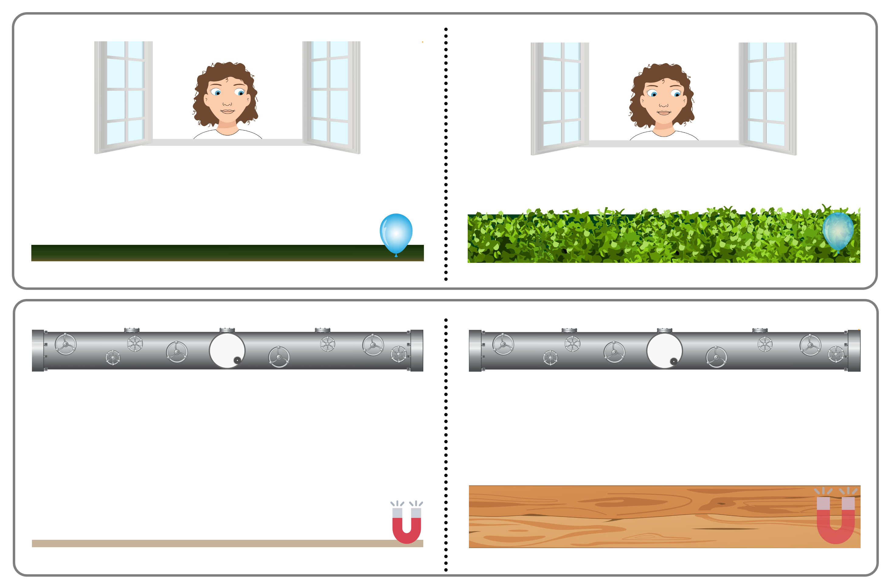

```{r setup, include = FALSE}
library("tidyverse")
library("papaja")
library("kableExtra")
library("brms")

theme_set(theme_classic())
```

```{r analysis_preferences}
# Seed for random number generation
set.seed(42)
knitr::opts_chunk$set(cache.extra = knitr::rand_seed)
```

# Variation in gaze understanding across the life span: A process-level perspective

**Authors:** Julia Christin Prein^1^, Luke Maurits^1^, Annika Werwach^1^, Daniel B. M. Haun^1,\*^, Manuel Bohn^1,2,\*^

**Affiliations:** ^1^ Department of Comparative Cultural Psychology, Max Planck Institute for Evolutionary Anthropology, Leipzig, Germany.
^2^ Institute of Psychology, Leuphana University Lüneburg, Germany.
^\*^ shared senior authorship

**ORCiD**: *Julia Christin Prein* <https://orcid.org/0000-0002-3154-6167>

**Conflicts of interest:** The authors declare that they have no conflict of interest.

**Data availability statement:** The web application (<https://ccp-odc.eva.mpg.de/tango-demo/>) described here is open source (<https://github.com/ccp-eva/tango-demo>).
The data sets generated during and/or analysed during the current study are available in the [gazecues-modeling] repository (<https://github.com/ccp-eva/gazecues-modeling>).
All experiments were pre-registered (<https://osf.io/zjhsc/>).

**Acknowledgements:** We thank Jana Jurkat for her help with data collection and participant recruitment.
We would also like to thank Steven Kalinke for his technical programming support.

**Funding:** This study was funded by the Max Planck Society for the Advancement of Science, a noncommercial, publicly financed scientific organization (no grant number).
We thank all the children, caregivers, and adults who participated in the study.

**Ethical statement:** The studies were approved by an internal ethics committee at the Max Planck Institute for Evolutionary Anthropology, Leipzig, Germany.Informed consent was obtained from all individual participants or their legal guardians.

\newpage

# Research highlights

-   up to four bulleted points outlining the key contributions to research the paper makes.
-   The Research Highlights should be placed before the abstract.
-   Each research highlight should not be longer than 25 words.

# Introduction

-   why do we care about developmental trajectory? ref to stat learning paper
-   variation

## Why do we need gaze understanding?

How do humans learn about their environment and navigate through their social surroundings?
One possibility to extract information from the environment is through following others' focus of attention.
Building a common ground is considered especially important in communicative interactions and shared activities [@tomasello2007reliance].

## How does gaze following emerge?

Existing studies operationalize gaze following as the ability to follow another agent's line of sight.
As one of the most fundamental social-cognitive abilities, it has been extensively studied in infancy and early childhood.
Infants as young as six months can attune their gaze to that of another agent [@dentremont1997demonstration].
At the end of their first year of life, infants can follow gaze to locations outside their current visual field and move themselves to gain proper perceptual access [@moll200412].

While the emergence of gaze following has been well established, less is known about the developmental trajectory throughout childhood and adolescence.
One possibility is that our social-cognitive ability in question is fully developed once emerged in infancy.However, many cognitive abilities develop with age [e.g., working memory, @gathercole2004structure].
Similarly, visual processing appears to improve with age.
Therefore, children could potentially improve in gaze following, fine-tuning the performance of the already existing skill.

## The scope of infants' gaze following ability

Though these studies suggest that young infants can align their visual attention to another's line of sight, it does not necessarily include understanding the intentions of the other agent.
Infants could simply attune their orientation or be attracted by others' gaze without processing what exactly the other is seeing (cf. Butterworth & Jarrett's ecological and geometric mechanism, @butterworth1991minds]. Therefore, it is crucial to study children's intentional understanding of gaze.

@moore1997role showed that 9-month-olds followed an agent's gaze more, when it was accompanied by a dynamic head turn in comparison to a static head turn.

In a hiding game with two search locations, @povinelli1997exploitation found that three-year-olds used gaze as a cue to locate the reward, while two-year-olds performed at chance level.

In a similar object choice paradigm with two containers, @behne2005oneyearolds investigated whether infants understand the communicative intent behind pointing and gaze cues.
In contrast to @povinelli1997exploitation, they found that already 14-month-olds used the agent's cues to select an object.
In conditions with absent-minded 'cues', infants performed around chance.
This could be interpreted as infants recognizing the nature of this joint activity: namely, that the adult's behavior was beneficial and relevant for their object choice.

### Head vs eye direction

It is important to note that in many existing gaze conditions, the experimenter shifted their eyes and head in synchrony (e.g., [@povinelli1997exploitation, @behne2005oneyearolds]).
Instead of pointing towards gaze understanding, a critic could claim that the results can be explained by face direction alone.

A handful of studies approached this potential confound by separately manipulating head and eye movement.
@brooks2002importance implemented a comparison between eye and head orientation and found that 14-month-olds were sensitive to open versus closed eyes.

Investigating the 'cooperative eye hypothesis', @tomasello2007reliance implemented six conditions, in which an experimenter oriented towards the ceiling with their eyes only, head only (eyes closed), both head and eyes, or neither.
They found that human infants relied more on the eye movement, while chimpanzees paid more attention to the head movement.

Importantly, the subjects were not presented with an object choice but their attention orientation was measured.

-   [@raviv2018developmental]

-   [@astor2022gaze]

-   [@colombo2001development]

-   [@scaife1975capacity]

-   [@itakura1998use]

-   [@carpenter1998social] "Several other studies have attempted to determine more precisely the cue that infants are using when they follow the gaze direction of others, that is, whether they use adults' head or eye orientation. In tasks comparing infants' responses when the experimenters turned their head and eyes together to targets with their responses when the experimenters directed their eyes to the targets but their head remained facing forward, Corkum and Moore (1995), Lempers (1979), and Lempers, Flavell, and Flavell (1977) all found that only infants age 12 months and older responded correctly when eyes and head were oriented in the same direction and that infants at all ages (i.e., through 19 months) performed poorly when eye and head direction diverged" (p.10-11) object choice.

-   [@silverstein2021infants] for vertical plane

-   [@zhang2019role]

-   [@frischen2007gaze]

-   [@lee1998children]

-   [@coelho2006searching]

## Aim of the current project

### Developmental trajectory, measuring & modeling individual differences

In this study, we were interested in the developmental trajectory of gaze understanding.
While we expect the younger children to be able to follow gaze, we aimed at assessing the differentiation of their social-cognitive ability.
Our goal was *not* to establish the youngest age at which children understand gaze cues.
Rather, we wanted to examine how that ability changes with age.

In our study, we focused on the communicative intents of gaze: we asked children to locate a target by following an agent's gaze.
While language demands were kept low, the participants had to actively respond and, therefore, make use of the presented gaze cue.

A unique contribution of this study is the richness of the data set.
Methodological challenges arise when trying to compare data across ages from qualitatively and quantitatively different study tasks.
We could circumvent these issues by applying the exact same task for the entire life span.

# Study 1: Gaze understanding across the lifespan

We aimed at assessing the developmental trajectory of gaze understanding across the lifespan.
First, we were interested in how this ability changes with age: Is the ability to understand gaze fully developed once emerged in infancy and stays stable across the lifetime?
Or do we fine-tune our already existing ability in early adulthood?
Do we then potentially even notice an age decay later in adulthood?
Second, we were interested in individual differences across the age groups.
Does the variation between individuals decrease, the older they get?
Do all adults reach the same level of precision in gaze understanding?

Due to the sheer number of participants, we restricted this analysis to a remote sample.
Pre-registrations can be found here: <https://osf.io/snju6> (child sample) and <https://osf.io/6yjz3> (adult sample).
The study obtained ethical clearance by the MPG Ethics commission Munich, Germany, falling under an umbrella ethics application (Appl. No. 2021_45), and was approved by an internal ethics committee at the Max Planck Institute for Evolutionary Anthropology.
The research adheres to the legal requirements of psychological research with children in Germany.
Data was collected between May 2021 and April 2023.

<https://osf.io/6yjz3>

```{r lifespan_sample, include = T, out.width = "100%"}
lifespan_sample <- readRDS("../saves/lifespan_sample.rds")

lifespan_table <- lifespan_sample %>% 
  mutate(
    n = str_glue_data(., "{n_total} ({n_females} female)"), 
    `Age range` = str_glue_data(., "{age_min} - {age_max}"), 
  ) %>% 
  rename(
    `Age group` = age_group,
    `Age SD` = age_sd, 
    `Age mean` = age_mean
  ) %>% 
  select(`Age group`, n, `Age mean`, `Age range`, `Age SD`)

apa_table(lifespan_table)
```

## Participants

We collected data from a remote child, teenager and adult sample, reaching from 3 to 80 years of age.

The child and teenager sample consisted of `r sum(lifespan_sample$n_total[lifespan_sample$age_group < 18])` participants.
We recruited participants via an internal database consisting of families living in Leipzig, Germany, who volunteered to participate in child development studies and indicated an interest in online studies.
Participants came from ethnically homogeneous, mixed socioeconomic backgrounds with mid to high parental education levels.
They lived in an industrialized, urban Central-European context in a mid-size German city (∼600,000 inhabitants; median individual monthly net income \~ 1,600€ as of 2021).
Most were raised monolingually in a nuclear two-generational family setting.
Information on demographics and socioeconomic status was not formally recorded on a participant level.

Adults were recruited via *Prolific* [@palan2018prolific].
*Prolific* is an online participant recruitment service from the University of Oxford with a predominantly European and US-American subject pool.
Participants consisted of `r sum(lifespan_sample$n_total[lifespan_sample$age_group >= 20])` English-speaking adults that reported to have normal or corrected-to-normal vision.
For completing the study, subjects were paid above the fixed minimum wage (on average £10.00 per hour).
For further information on age and gender of participants, see Table 1.

## Materials

We used the continuous version of the TANGO [@prein2023tango].
The task was presented as an interactive web application (see Figure \@ref(fig:fig1); live demo [https://ccp-odc.eva.mpg.de/tango-demo/](https://ccp-odc.eva.mpg.de/tango-demo/.); source code <https://github.com/ccp-eva/tango-demo>).
The TANGO showed satisfactory internal consistency and retest reliability [with reliability estimates *Pearson's r* ranging from .7 to .8 for the continuous task version; @prein2023tango].

Each trial presented an agent standing in a window, watching a balloon (*i.e.*, target) falling to the ground.
The target fell behind a hedge, while the agent's gaze followed the target's trajectory: pupil and iris moved so that their center aligned with the target center.
In test trials, the target flight was covered so that participants could not see where the target landed.
Participant were tasked to locate the target by tracking the agent's gaze.
They could respond by touching on the screen.

Four familiarization trials ensured that participants understood the task and felt comfortable with the response format.
Then, 15 test trials followed.
Completing the 19 trials took approximately 5-10 minutes.

The outcome measure was imprecision, defined as the absolute difference between the target center and the x coordinate of the participant's click.
Target coordinates were randomly generated during runtime.
Each target bin, as well as all agents and target colors, occurred equally often and and did not appear in more than two consecutive trials.

(ref:figlab1) **Setup of the TANGO and Magnet tasks**. (A) TANGO: Gaze understanding task. The agent stands in a window with the target in front of them. A hedge grows and covers the target. The target falls to a random location on the ground. The agent's eyes track the movement of the target. (B) Magnet task: non-social vector estimation.

```{r fig1, include = T, out.width = "100%", fig.align = "center", fig.cap = "(ref:figlab1)"}

```

## Procedure

Children and teenagers received a personalized link to the study website.
Caregivers were asked to provide technical support whenever needed, while explicitly being reminded to not help their children in responding.
Webcam videos were recorded whenever consented and technically feasible, in order to monitor whether children and teenagers responded on their own.

Adults completed the online study unsupervised.

## Analysis

We ran all analyses in `r R.version$version.string` [@rcoreteam2022language].
Regression models were fit as Bayesian generalized linear mixed models (GLMMs) with default priors for all analyses, using the function `brm` from the package `brms` [@burkner2017brms; @burkner2018advanced].

To estimate the effect of age on gaze understanding, we fit GLMMs that make different assumptions about the developmental trajectory, modeling the relationship as linear, quadratic, cubic.
In addition, we applied a Gaussian Process model [@burkner2017brms] and examined nonlinearity.
The models predicted imprecision by age (continuous).
[^1] Imprecision was defined as the absolute click distance between the target center and the click X coordinate, scaled according to target widths, aggregated across trials, and modeled by a `lognormal` distribution.
We inspected the posterior distributions (mean and 95% Credible Interval (CrI)) for the age estimates and compared models using LOO and WAIC scores and model weights.

[^1]: Originally, our models implemented the following structure: `performance ~ age + symmetricPosition + trialNr + (1 + symmetricPosition + trialNr | subjID)`.
    However, the Gaussian Process model was computationally heavy.
    To circumvent issues of convergence and for practicability, we simplified the model structure to include only age as an effect.
    In the Supplements, you can find a comparison between the original and the here reported model structures.
    Essentially, the model predictions did not differ notably.

To further assess developmental change, we performed a Bayesian change-point analysis, using the package `RBeast` [@zhao2019detecting].
The function `beast.irreg` handled the irregular nature of our series, which did not have the same number of data points for each year in age.
We were interested in finding the most prominent, most likely change-points in our data, assuming a constant mean (i.e., a flat line) within each segment.
Additionally, we wanted to avoid "overreactions" to individual outlying data points.
Therefore, we restricted our search to a maximum number of five change-points and a minimum length of 9.1245 data points between change-points (corresponding to the product of mean age difference between consecutive points \* mean number of data points within 3 years \* 3).
We inspected the probability of number of change-points and the locations of these change-points (mean and 95% CrI).
See Supplements for change-point analyses with differently set parameters.

## Results

(ref:figlab2) **Differentiation in gaze understanding**. Performance is measured as imprecision, i.e., the absolute distance between the target's center and the participant's click (averaged across trials). The unit of imprecision is counted in the width of the target, i.e., a participant with imprecision of 1 clicked on average one target width to the left or right of the true target center.

```{r fig2, include = T, out.width = "100%", fig.align = "center", fig.cap = "(ref:figlab2)"}
knitr::include_graphics(c("../figures/lifespan_plot.png"))
```

[TODO] report model comparison

We found a clear non-linear development in gaze understanding across the lifespan.
Early in childhood, children quickly enhanced their level of proficiency.
Performance peaked around early adulthood.
There was a minor decay in elderly adulthood.
Our Gaussian Process model indicated non-linearity: XXX.
The Bayesian change-point analysis revealed four major shifts in gaze understanding during the lifespan: We see a very rapid initial improvement in early childhood (3 change-points in rapid succession), followed by a long period of minor, very slow change with slightly increasing levels of imprecision toward the eldest in our sample.

## Discussion

Three-year-olds were surprisingly inaccurate in their responses.
One possible explanation could be that they simply lacked the ability to complete the task, potentially due to issues in gaze-following.
Contrasting our results with previous findings on infant gaze-following, this explanation is unlikely.
A more likely explanation would be that children were able to follow the agent's gaze but struggled to translate this implicit understanding into active behavior.
Another point to keep in mind is that we used subtle eye movements as cues.
Many existing studies let the agents move eye and head in parallel, therefore establishing a confound with greater (head) movement.
Relying exclusively on the eye movement might be trickier for children than when presented with a combined eye and head orientation.
The performance of the youngest children seems more consistent with performance demands than with a failure in gaze following.

Regarding the sample of elderly adults, there is most likely a sampling bias present.
Elderly which know how to participate in *Prolific* studies certainly might show greater cognitive fitness compared to their offline counterparts.

Methodological challenges arise when trying to compare data across ages from qualitatively and quantitatively different study tasks.
We could circumvent these issues by applying the exact same task for the entire life span.

# Study 2: Computational cognitive model

Our lifespan study showed that gaze understanding develops throughout childhood, and variation between individuals appears in all age groups.
The TANGO has previously been proven reliable for capturing inter-individual differences in gaze understanding [@prein2023tango].
The variation between participants is thus likely genuine and not due to random noise.
Now, we aim to understand what explains the developmental change and the variation across participants on a process level.
We present a theory of gaze understanding that explains how children use all available information to make inferences about the agent's gaze and its attentional focus, which leads them to correctly identify the target position.
We formalize this inference process in a computational cognitive model.

Computational modeling frameworks allow researchers to establish mechanistic explanations of psychological phenomena [@grahek2021anatomy].
As formal, mathematical accounts of the psychological process in question, they force researchers to accurately and comprehensively state all their underlying assumptions [@simmering2010dialogue].
In addition, models can be used to simulate behavior and form testable predictions.
The expected patterns can then, in turn, be compared to the empirically observed behavior.

We seek to explain how participants solved the TANGO.
Our gaze model assumes that participants use available gaze information to infer the target location.
We quantify how well our model explains the gaze understanding process by comparing it to two alternative models that make different assumptions of which information children use and where they consequently click to locate the target.
Therefore, our modeling framework consists of three mutually exclusive models: (1) a gaze model, (2) a random guessing model, and (3) a center bias model.
We gauge which model can best explain our data by conducting a model comparison.

With our modeling framework, we can formalize whether a participant (A) uses the available gaze information at all and (B) how accurately they are in using this gaze information to locate the target.
Regarding developmental change, we hypothesize that a dual process could explain the development of gaze understanding: The older children are, the more likely they are to use gaze as a cue, and the more precise they become at using it to locate the target.

Task design, data collection, and sample sizes were pre-registered: <https://osf.io/r3bhn>.
The study design and procedure obtained ethical clearance by the MPG Ethics commission Munich, Germany, falling under a packaged ethics application (Appl. No. 2021_45), and was approved by an internal ethics committee at the Max Planck Institute for Evolutionary Anthropology.
The research adheres to the legal requirements of psychological research with children in Germany.
Data were collected between May and August 2021.

```{r gazemodel_sample}
gazemodel_sample <- readRDS("../saves/gazemodel_sample.rds")
```

## Participants

The sample consisted of `r sum(gazemodel_sample$n_total[gazemodel_sample$age_group < 6])` children, including `r gazemodel_sample$n_total[gazemodel_sample$age_group == 3]` three-year-olds (mean age = `r gazemodel_sample$age_mean[gazemodel_sample$age_group == 3]` years, SD = `r gazemodel_sample$age_sd[gazemodel_sample$age_group == 3]`, range = `r gazemodel_sample$age_min[gazemodel_sample$age_group == 3]` - `r gazemodel_sample$age_max[gazemodel_sample$age_group == 3]`, `r gazemodel_sample$n_females[gazemodel_sample$age_group == 3]` girls), `r gazemodel_sample$n_total[gazemodel_sample$age_group == 4]` four-year-olds (mean age = `r gazemodel_sample$age_mean[gazemodel_sample$age_group == 4]` years, SD = `r gazemodel_sample$age_sd[gazemodel_sample$age_group == 4]`, range = `r gazemodel_sample$age_min[gazemodel_sample$age_group == 4]` - `r gazemodel_sample$age_max[gazemodel_sample$age_group == 4]`, `r gazemodel_sample$n_females[gazemodel_sample$age_group == 4]` girls), `r gazemodel_sample$n_total[gazemodel_sample$age_group == 5]` five-year-olds (mean age = `r gazemodel_sample$age_mean[gazemodel_sample$age_group == 5]` years, SD = `r gazemodel_sample$age_sd[gazemodel_sample$age_group == 5]`, range = `r gazemodel_sample$age_min[gazemodel_sample$age_group == 5]` - `r gazemodel_sample$age_max[gazemodel_sample$age_group == 5]`, `r gazemodel_sample$n_females[gazemodel_sample$age_group == 5]` girls).
Data of children was collected in kindergartens located in Leipzig, Germany.
The children within each kindergarten were recruited via an internal database, where each parent priorly consented to child development studies.

In addition, we included `r gazemodel_sample$n_total[gazemodel_sample$age_group == 18]` adults from our Lifespan study (mean age = `r gazemodel_sample$age_mean[gazemodel_sample$age_group == 18]` years, SD = `r gazemodel_sample$age_sd[gazemodel_sample$age_group == 18]`, range = `r gazemodel_sample$age_min[gazemodel_sample$age_group == 18]` - `r gazemodel_sample$age_max[gazemodel_sample$age_group == 18]`, `r gazemodel_sample$n_females[gazemodel_sample$age_group == 18]` female).
Adults were recruited over *Prolific* [@palan2018prolific].
Since developmental change was minimal in our adult sample (see Lifespan study) and the cognitive models were computationally heavy, we decided to only include the first 50 adults that had completed the study.

## Procedure

We applied exactly the same procedure as in the first study, employing the continuous version of the TANGO [@prein2023tango].
Children were tested in a quiet room in their kindergarten, while an experimenter guided the child through the study on a tablet.
Adults participated online.

## Analysis

Our goal was to describe the inferential process by which participants locate the target.
We compared three computational cognitive models: (1) a gaze model, (2) a random guessing model, and (3) a center bias model.
All cognitive models and model comparisons were implemented in WebPPL [@goodman2014design].

The gaze model assumes participants use the agent's gaze as a cue to locate the target.[^2]
Participants are assumed to observe the current location of the pupil and estimate the center of the agent's eyeball.
Connecting these two point estimates as a line yields a gaze vector: the unique vector that extends from the center of the agent's eyeball through the center of the pupil to the attentional focal point.
This inferential process involves some uncertainty about the true center of the eyeball.
Participants are assumed to sample gaze vectors from a Normal distribution centered around the true gaze vector.
They are assumed to do this independently for the left and right eye and then integrate the information to estimate the target's location.

[^2]: This model mirrors the logic of the TANGO programming code.
    In the online experiment, we read out the center point coordinates of the target and the agent's eyeball (i.e., the SVG coordinates).
    We then calculate a line between these two points: this is our gaze vector.
    Now, knowing the eyeball radius, we calculate the point of intersection at which the gaze vector meets the eyeball boundary.
    Finally, the agent's pupil moves from the center of the eyeball along the gaze vector to the intersection point.
    This way, the agent is animated to "look at" the target.
    In the gaze model, we assume participants go through these steps in reverse order.

Now, individuals can differ in how wide their distribution around the true gaze vector is.
The model's inferential component, α, estimates the standard deviation of the distribution for each individual participant.
With higher standard deviations (i.e., increased α), participants are expected to show decreasing precision in estimating the target location.
The model assumes that the sensitivity to the available gaze information changes with age.

The geometry of sampling from a distribution around the gaze vector leads to an interesting, testable group-level prediction.
As the pupil location varies, a fixed amount of uncertainty around the gaze vector corresponds to a varying degree of uncertainty in the estimated target location.
When the agent directs their gaze toward the very left or right side, the distribution around the gaze vector from which participants sample is comparatively wider than when the agent gazes centrally to the ground in front of them.
For illustrative purposes, imagine a similar phenomenon: pointing a torch light to the ground.
When one directs the torchlight straight onto the ground, the light beam is clearly defined and smaller than when one points the torchlight further away from oneself.
Therefore, our gaze model predicts that our trials vary in difficulty: participants should be more imprecise in locating the target the further out it lands.
If our data matches the pattern of this model prediction, this can act as evidence for the gaze model.
Therefore, our gaze model provides a quantitative theory of gaze understanding, with testable model predictions.

To gauge the plausibility of our gaze model, we implemented two models that represent alternatives about how participants solve the TANGO.
Participants who are overall very imprecise in locating the target might be less likely to use the agent's gaze as a cue at all.
The alternative models, therefore, do not assume that participants make use of the gaze cue.
The first alternative model estimates how likely a participant engages in random guessing.
This behaves like a coin toss, sampling from a uniform distribution over all possible coordinates (i.e., 0 - 1920).
The second alternative model estimates how likely a participant shows a center bias: Participants' clicks could be drawn toward the screen center since the agent and the starting point of the balloon are located there.
This bias is implemented as sampling from a Normal distribution, with the center of the screen as the mean and one target width as the standard deviation.

Our three proposed models make different predictions about how participants' clicks will be distributed for different target locations.
We visualize and evaluate these differences using correlations between the model predictions and the data.
Furthermore, we evaluated these probabilistic models based on the marginal likelihood of the data under each model.
The pairwise ratio of marginal likelihoods for two models is also known as the Bayes Factor.
This factor quantifies the quality of a model's predictions by averaging over the possible values of the model's parameters weighted by the prior probabilities of those parameter values.
It can be used to estimate how much more likely the data under one model are compared to the other.
Bayes Factors implicitly consider model complexity (i.e., Bayesian Occam's razor): models with more parameters often have a broader prior distribution over parameters, which might weaken potential gains in predictive accuracy.
Details on models, including code to run the models, information about priors for parameter estimation, and Markov chain Monte Carlo settings, can be found in the associated online repository.

## Results

When we compared the gaze model to the two competitor models, we found little support for the two alternatives.
Comparing the models using marginal likelihood of the data under each model, the data were XXX [TODO] more likely under the gaze model compared to the random clicking or center bias model.

For the gaze model, we found a high similarity between the model predictions and the observed data across the entire age range.
The developmental trajectory that we observed in the data closely resembled the predictions of the model.
The model explained XXX% [TODO] of the variance in the data.

(ref:figlab3) **Gaze funnel**

```{r fig3, include = T, out.width = "100%", fig.align = "center", fig.cap = "(ref:figlab3)"}
knitr::include_graphics("../figures/gazefunnel_combined.png")
```

## Discussion

Our findings from Study 1 showed individual differences and a developmental change in gaze understanding across the lifespan.
To answer what develops with age and how participants differ from one another, we presented a formal cognitive model of gaze understanding.
Participants are modeled to observe all available gaze information, integrate it from both the agent's eyes, and consequently arrive at the attentional focus of the agent: the target location.
We assume that children become increasingly sensitive to gaze cues but that the inference process remains the same.
By conducting model comparisons, we could rule out that participants' responses can be explained by random guessing or a center bias.

A big advantage of using a computational modeling framework is that it can disentangle where people's errors come from.
Our computational model can explain what varies between precise and imprecise individuals.
There are two sources of errors: (1) do you actually use the eye gaze information?
and (2) how accurate are you at estimating the focus point when you do pay attention to the agent's eyes?
This way, we can track developmental changes in gaze understanding in a more fine-tuned way.

In addition, we observed differences in performance depending on where the agent looks.
The observed data showed that precision levels dropped as the agent's gaze moved further away from the center.
Our gaze model predictions recovered this "signature pattern" in the data.
Future research could use this signature in the data as evidence of whether diverse communities employ the same inferential mechanism to solve the task, speaking for a shared cognitive architecture.

A limitation of our model is that we cannot disentangle how much of the participants' uncertainty comes from a noisy estimate of the agent's attentional focus and how much is due to imprecise clicking (e.g., wanting to click somewhere but experiencing motor issues at aiming, adding random noise to the click).
Initially, our proposed gaze model consisted of three components: (1) a perceptual component, whereby the participant produces a noisy observation of the agent's eye angle, (2) an inferential component, whereby the participant estimates the agent's point of attention based on the above perceptual component, and (3) a motor component, whereby the participant samples a click location from a distribution centered around the above estimate of the agent's attentional focus.
Simulation studies suggested it was difficult to disentangle the independent noise terms from these three components, so we simplified the gaze model to include only the inferential component.

# Study 3: Components of gaze understanding

Our computational cognitive model assumes that the ability to engage in vector estimation is a crucial component of mastering gaze understanding.
In this study, we sought to experimentally isolate the physical vector estimation component.
In addition, we inquired whether there are any other cognitive processes outside the vector estimation that constitute gaze understanding.
We aimed to assess whether there are exclusively task-specific processes at hand or whether gaze understanding recruits a general social-cognitive ability that is shared among other social-cognitive tasks.

First, we aimed to isolate the vector estimation component of the gaze understanding task.
We designed a new non-social vector estimation task that shared all crucial design features of the gaze understanding task.
Second, we assessed children's social-cognitive abilities by administering a ToM task battery, comprising four tasks from the ToM scale by Wellman and Liu (@wellman2004scaling) and two additional perspective-taking tasks [@flavell1981development; @flavell1981younga].

Our reasoning was that the gaze understanding task shares task demands with the non-social vector estimation task, while it shares its social context with the ToM tasks.
This way, we can disentangle what components comprise gaze understanding.

Task design, data collection, and sample sizes were pre-registered: <https://osf.io/xsqkt>.
The study design and procedure obtained ethical clearance by the MPG Ethics commission Munich, Germany, falling under a packaged ethics application (Appl. No. 2021_45), and was approved by an internal ethics committee at the Max Planck Institute for Evolutionary Anthropology.
The research adheres to the legal requirements of psychological research with children in Germany.
Data were collected between February and March 2023.

## Participants

```{r magnet_sample}
magnet_sample <- readRDS("../saves/magnet_sample.rds")
```

Testing took place in kindergartens in Leipzig, Germany.
The sample consisted of `r magnet_sample$n_total` children (mean age = `r magnet_sample$age_mean` years, SD = `r magnet_sample$age_sd`, range = `r magnet_sample$age_min` - `r magnet_sample$age_max`, `r magnet_sample$n_females` girls).
Information on individual socio-economic status was not formally recorded.
Children in our sample live in an industrialized, urban Central-European city with approximately 600,000 inhabitants.
Households often consist of nuclear families with few household members.
The majority of families in our data base come from mainly mid to high socio-economic backgrounds with high levels of parental education.

## Procedure

Children were tested in a quiet room in their kindergarten.
An experimenter guided the child through the study.
Since our research questions related to individual differences and we wanted maximum control of extraneous participant variables, we employed a within-subjects study design.
All participants performed the following tasks in a fixed order: (1) non-social vector estimation task, (2) ToM task battery, (3) gaze understanding task.
Several reasons motivated this decision.
First, we decided on a fixed order to be able to compare participants' performance straight-forwardly with each other.
Second, to increase participant engagement and decrease fatigue or fuzziness, we switched from a tablet task to tasks with personal interaction back to a tablet task.
Third, we showed the non-social vector estimation task before the gaze understanding task so that participants would not be biased to interpret the presented stimuli as "eye- /"agent-like".

### Non-social vector estimation

Modeling the setup and structure of the previously applied gaze understanding task, we designed a non-social vector estimation task.
This task was also presented as a webapp on a tablet and made use of the concept of magnetism.
The setup looked as follows.
On the upper part of the screen, there was a tube with a gearwheel located in a circular window.
On the floor, there lay a magnet.
The magnet then got switched on (making a cartoon-like sound), whereupon the gearwheel moved towards the magnet.
The gearwheel moved in a way that its center aligned with the center of the magnet, while staying inside the circular window.
Participants were then asked to locate the magnet.
Access to the magnet's true location was manipulated by a wooden wall: participants either had full, partial, or no visual access to the true magnet location.
When no information about the magnet location was accessible, participants were expected to use the gearwheel inside the window as a non-social cue to locate the magnet.

As in the TANGO, there were three different trial types depending on the visual access to the true magnet location.
In full visual access trials, the magnet's location was presented without impediment (i.e., no wooden wall).
In partial visual access trials, the wooden wall was moved in front of the target after the magnet's location had already been visible.
In test trials, participants had no visual access to the magnet's location because the wall covered the magnet from the beginning of the trial.

Children received 19 trials with one full visual access trial, two partial visual access trials, and 16 test trials.
The first trial of each type comprised a voice-over description of the presented events.
We conducted our analysis with 15 test trials (excluding the voice-over trial).
The outcome variable was imprecision, defined as the absolute difference between the magnet's x coordinate and the x coordinate of the participant's click.
Magnet coordinates were generated as follows.
The full width of the screen was divided into ten bins.
Each bin occurred equally often, while the same bin could occur in two consecutive trials.
Exact coordinates within each bin were randomly generated.

### Theory of Mind task battery

We administered four tasks from the @wellman2004scaling Theory of Mind scale.
We excluded three tasks: the Diverse Desires task in order to avoid ceiling effects; and both tasks involving emotions (Belief Emotion and Real-Apparent Emotion), as we aimed at assessing the "cold, cognitive" (as compared to the "emotional") aspects of social cognition.
Instead, we added two perspective-taking level-2 tasks [@flavell1981development; @flavell1981younga].
We added the perspective-taking tasks (1) with the aim of increasing the task battery's difficulty, and (2) since we hypothesized that perspective-taking would rely on similar mechanisms than gaze understanding.
The dependent variable was the aggregate score of all solved ToM tasks (see Supplements for further detail).
In an exploratory analysis, we investigated if gaze understanding was more strongly associated with the two perspective-taking tasks compared to the other ToM tasks, as perspective-taking seems most closely theoretically related to gaze understanding (i.e., in both cases the participant is asked to judge another person's point of view).

### Gaze understanding

As in the two previously reported studies, we presented children with the continuous version of the TANGO [@prein2023tango].
To accentuate the social aspect of the gaze understanding task, we exchanged the animal agents (used in the previous two studies) with human faces, which were modeled after the local population in appearance (already created for another project on cross-cultural similarities in gaze understanding (<https://osf.io/tdsvc>)).
This further highlighted the contrast (i.e., social vs. non-social context) to the non-social vector estimation task.[^3]

[^3]: In an exploratory analysis, we compared children's imprecision levels in the TANGO task with animal vs. human agents.
    Based on a GLMM analysis, we conclude that there was no evidence of a stable effect of stimulus choice (human vs. animal).
    See Supplements for further detail.

## Analysis

By design, both the gaze understanding task as well as the non-social vector estimation task involve vector estimation.
On the basis of the results from our computational cognitive model, we expected that children's performance in both tasks correlate with each other.
For each of these two tasks, we calculated the mean level of imprecision for each subject.
We then correlated these two scores using *Pearson's* correlation coefficients.

Regarding the relationship between the two vector estimation tasks and the ToM measures, we could imagine two possible scenarios: (A) If gaze understanding recruits a general social-cognitive ability beyond vector estimation, we expected that gaze understanding and ToM measures would correlate more strongly with each other than non-social vector estimation and ToM measures.
(B) If gaze understanding relies purely on task-specific processes, then the correlation between gaze understanding and ToM measures would be comparable to the correlation between non-social vector estimation and the ToM measures.
For the association between the aggregate ToM scores and the gaze understanding / non-social vector estimation tasks, we used *Spearman's* rank correlation coefficients.

We compared the correlation between gaze understanding and ToM measures and the correlation between non-social vector estimation and ToM measures by using the Williams' test from the function `cocor.dep.groups.overlap` (designed for two dependent overlapping correlations) from the package `cocor` [@diedenhofen2015cocor].

Furthermore, to estimate which components best explain the gaze understanding score, we conducted a model comparison with GLMMs predicting the mean imprecision in gaze understanding by age, imprecision in non-social vector estimation, the ToM aggregate score, or the aggregate of the two perspective-taking tasks (subset of ToM battery; example of model notation in `R: tango_mean ~ age_centered + magnet_scaled + perspective_scaled`).
We wanted to assess whether the ToM aggregate score or the singled-out perspective-taking score added additional explanatory value when predicting the gaze understanding score.
The outcome variable was modeled by a lognormal distribution.

## Results

```{r magnet_results}
magnet_williamsttest_tom <- readRDS("../saves/williams_tom.rds")
magnet_williamsttest_perspective <- readRDS("../saves/williams_perspective.rds")
magnet_cormatrix <- readRDS("../saves/magnet_cormatrix.rds")
magnet_model <- readRDS("../saves/magnet_winningmodel.rds")
```

As expected, we found that gaze understanding as a social vector estimation task correlated with the non-social vector estimation task, *r* = `r magnet_cormatrix$r[magnet_cormatrix$Correlation == "Tango x Magnet"]`, 95%CI [`r magnet_cormatrix$lower[magnet_cormatrix$Correlation == "Tango x Magnet"]`, `r magnet_cormatrix$upper[magnet_cormatrix$Correlation == "Tango x Magnet"]`].
Importantly, however, the two vector estimation tasks were not redundant: only a part of the variance in gaze understanding could be explained by non-social vector estimation.

Gaze understanding and perspective-taking showed a *Spearman* correlation coefficient of $\rho$ = `r magnet_cormatrix$r[magnet_cormatrix$Correlation == "Tango x Perspective-taking"]`, 95%CI [`r magnet_cormatrix$lower[magnet_cormatrix$Correlation == "Tango x Perspective-taking"]`, `r magnet_cormatrix$upper[magnet_cormatrix$Correlation == "Tango x Perspective-taking"]`], while non-social vector estimation and perspective-taking did not correlate, $\rho$ = `r magnet_cormatrix$r[magnet_cormatrix$Correlation == "Magnet x Perspective-taking"]`, 95%CI [`r magnet_cormatrix$lower[magnet_cormatrix$Correlation == "Magnet x Perspective-taking"]`, `r magnet_cormatrix$upper[magnet_cormatrix$Correlation == "Magnet x Perspective-taking"]`].
According to the Williams' test, these two correlations did not differ significantly from each other, *t*(`r magnet_williamsttest_perspective$parameter`) = `r round(magnet_williamsttest_perspective$statistic, 2)`, *p* = `r round(magnet_williamsttest_perspective$p.value, 2)`.

Our model comparison revealed that gaze understanding was best predicted by a model including non-social vector estimation ($\beta$ = `r fixef(magnet_model)["magnet_scaled", "Estimate"]`, 95% CrI [`r fixef(magnet_model)["magnet_scaled", "Q2.5"]`; `r fixef(magnet_model)["magnet_scaled", "Q97.5"]`]) and perspective-taking ($\beta$ = `r fixef(magnet_model)["perspective_scaled", "Estimate"]`; 95% CrI [`r fixef(magnet_model)["perspective_scaled", "Q2.5"]`, `r fixef(magnet_model)["perspective_scaled", "Q97.5"]`]), even when controlling for age ($\beta$ = `r fixef(magnet_model)["age_centered", "Estimate"]`, 95% CrI [`r fixef(magnet_model)["age_centered", "Q2.5"]`, `r fixef(magnet_model)["age_centered", "Q97.5"]`]).
See Supplements for further detail of the model comparison.

Taken together, this shows that the gaze understanding task recruited social-cognitive abilities beyond vector estimation.
Evidently, it shared some of its variance with other level 2 perspective-taking tasks, while the overall ToM aggregate score did not add explanatory power.

(ref:figlab4) **Components of gaze understanding.** (A) Correlations between gaze understanding, physical vector estimation, ToM, and perspective-taking. Dots show the correlation coefficients, while error bars represent 95% CIs. (B) Influence of perspective-taking and physical vector estimation on gaze understanding. The graph show the posterior distributions for the respective predictor. Black dots represent means, thicker black lines 80% CrI and thinner black lines 95% CrI.

```{r fig4, include = T, out.width = "100%", fig.align = "center", fig.cap = "(ref:figlab4)"}
knitr::include_graphics("../figures/magnet_arrangedplot.png")
```

## Discussion

By carefully isolating physical vector estimation experimentally, we could show that gaze understanding does indeed, to a certain degree, rely on this component.
This is in line with our computational cognitive framework that assumes vector calculations on a process-level.
However, physical vector estimation alone did not suffice to explain gaze understanding.
In addition, perspective-taking proved to be a relevant social-cognitive ability.

In previous work, we could establish that the TANGO is suited as an individual differences measure [@prein2023tango].
Capturing meaningful variability in performance is a crucial task feature when we are interested in revealing the relationship between different cognitive abilities.
Importantly, the tasks we used to measure ToM abilities were not designed to capture individual differences: they relied on an aggregate score of dichotomous measures.
These sum scores can only capture limited variance, which may obscure potential correlations.
However, since these tasks are the gold standard in the social-cognitive literature and continuous measures with satisfying psychometric properties are, to the best of our knowledge, still scarce, we nonetheless relied on them in this study.
It seems noteworthy to point out that lower correlations between ToM abilities and gaze understanding could be grounded in the design features of the applied ToM tasks.
We already stated this concern in the Pre-registration (<https://osf.io/xsqkt>).
The development of new measures to capture individual differences in social-cognitive abilities like false-belief understanding seems desirable and essential to move this line of research further.

# General discussion

# Limitations

# Conclusion

\newpage

# Declarations

... can be found on the title page.

\newpage

# References

```{=tex}
\begingroup
\setlength{\parindent}{-0.5in}
\setlength{\leftskip}{0.5in}
```
::: {#refs custom-style="Bibliography"}
:::

```{=tex}
\endgroup
```
