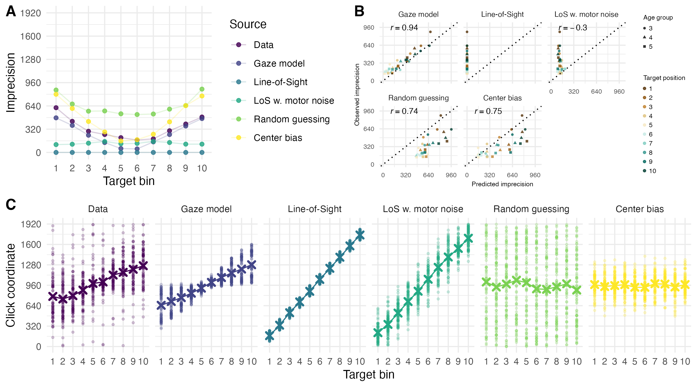

```{r global_options, include=FALSE}
knitr::opts_chunk$set(fig.pos = 'H')
```

```{r setup, include = FALSE}
library("papaja")
library("tidyverse")
library("ggpubr")
library("kableExtra")
library("brms")
theme_set(theme_classic())
```

```{r analysis_preferences}
# Seed for random number generation
set.seed(42)
knitr::opts_chunk$set(cache.extra = knitr::rand_seed)
```

# Study 1: Lifespan
## Participants
```{r lifespan_sample, include = T, out.width = "100%"}
lifespan_sample <- readRDS("../saves/lifespan_sample.rds")

lifespan_table <- lifespan_sample %>% 
  mutate(
    n = str_glue_data(., "{n_total} ({n_females} female)"), 
    `Age range` = str_glue_data(., "{age_min} - {age_max}"), 
  ) %>% 
  rename(
    `Age group` = age_group,
    `Age SD` = age_sd, 
    `Age mean` = age_mean
  ) %>% 
  select(`Age group`, n, `Age mean`, `Age range`, `Age SD`)

knitr::kable(lifespan_table, format = "latex", booktabs = TRUE) %>% 
  kable_styling(latex_options = c("scale_down", "HOLD_position"))
```

## Analysis
### Model structures
In the paper, we reported the following model structures: linear model: `mean_imprecision ~ age_centered`; quadratic model in `R: mean_imprecision ~ 1 + age_centered + I(age_centered^2)`; cubic model: `mean_imprecision ~ 1 + age_centered + I(age_centered^2) + I(age_centered^3);` Gaussian process model: `mean_imprecision ~ gp(age_centered, k=50, c=5/4, scale=TRUE)`. Note the additional parameters in the Gaussian process model. With the default settings, the underlying Gaussian process maths would get solved exactly. By providing the arguments `k` and `c`, we use an approximation process. The higher the value of k, the better the approximation: we have used `k=50` for faster processing speed and better diagnostics. `brms` suggests 5/4 as a value for `c`. Adding `scale=TRUE` is supposed to improve sampling speed and convergence. 

Originally, we fitted the models on a trial-by-trial basis with the following structure in `R: performance ~ age + symmetricPosition + trialNr + (1 + symmetricPosition + trialNr | subjID)`. However, the Gaussian Process model was computationally heavy. Therefore, we simplified the model structure, aggregated data on a subject level, and included only age as an effect. We then visually compared the model predictions of the original and the simplified models with each other. As you can see in Figure \@ref(fig:fig1), results of the two models did not differ notably. 

(ref:figlab1) **Comparison between models on a trial- or subject-level**. Grey dots show data of each trial. Solid lines show the mean predicted developmental trajectory for both models. Line color denotes model structure (yellow: trial-level; black: aggregated on subject-level). 

```{r fig1, include = T, out.width = "100%", fig.align = "center", fig.cap = "(ref:figlab1)"}
knitr::include_graphics(c("../figures/lifespan_plot.png"))
```

### Changepoint analysis
In our Bayesian changepoint analysis, we restricted the model to a constant mean (i.e., a flat line with zero degree polynomial) within each segment, and to have minimally 10 data points between two change points (i.e., corresponding to half of the data points we collected per adult decade) to avoid "overreactions" to individual outlying data points. In a supplementary analysis, we assessed how different parameter settings effected of our changepoint analysis. We changed the number of allowed change points, the minimum number of data points between change points, and the polynomial order. When the model had more explorative room, for example, by a greater number of change points, smaller minimum number of data points between change points, higher polynomial order, the model outputs showed more fine-grained change points. The exact location of the change points varied slightly. Overall, the interpretation stayed the same as the one we reported in the paper. While early childhood was characterized by much change, adults showed a relatively stable level of imprecision. There was a minor change in that elderly adults became slightly more imprecise again. If you are interested into the details, please have a look at the file `supplements_changepoint_parameters.html`, which you can find in the GitHub repository in the `stats` folder. 

# Study 2: Computational cognitive model 
## Analysis
### Gaze model prediction
Our gaze model predicts that TANGO trials vary in their difficulty, resulting in a U-shaped pattern: Participants' imprecision should increase, the further out the target lands (towards the very left/right sides). Since the task is presented on a screen, there is a natural border towards one side. Imagine the target lands to the very right side. Participants' imprecision cannot click further right because the screen ends; all their uncertainty about the target location faces the inner, left-hand side now. Therefore, the predicted U-shaped pattern should decrease again towards the screen borders. For previous reliability analyses [@prein2023tango], we had increased the trial number for an adult sample (N = 70; each 30 trials). Interestingly, here we found the expected shape in the data: the U-pattern decreased again towards the screen ends (Figure \@ref(fig:fig2)). 

(ref:figlab2) **Gaze funnel for adult sample with higher trial number**.
```{r fig2, include = T, out.width = "100%", fig.align = "center", fig.cap = "(ref:figlab2)"}
knitr::include_graphics("../figures/gazefunnel_adults.pdf")
```

## Inference parameter estimates per individual
As can be seen in Figure \@ref(fig:fig3) and Figure \@ref(fig:fig4), the gaze model estimated the inference parameter for each individual. Across individuals, the inference parameter varied in the estimated magnitude and level of uncertainty. In general, estimates for more precise individuals (i.e., smaller inference parameter value) showed decreased levels of uncertainty. 

(ref:figlab3) **Gaze model estimates faceted by individual**.
```{r fig3, include = T, out.width = "100%", fig.align = "center", fig.cap = "(ref:figlab3)"}
knitr::include_graphics("../figures/supplements_gazemodel_facetedinference.pdf")
```

(ref:figlab4) **Gaze model estimates ordered by descending inference parameter value**.
```{r fig4, include = T, out.width = "100%", fig.align = "center", fig.cap = "(ref:figlab4)"}
knitr::include_graphics("../figures/supplements_gazemodel_indinference.pdf")
```

\newpage

## Simulations

In the manuscript, we have described the gaze model and two alternatives: random guessing and a center bias. Here, we consider two more alternatives. Let us consider a model that assumes participants can infer the agent’s focus without any noise (for example, by tracing the line of sight). A model like this would assume that participants follow gaze without any uncertainty. Therefore, no U curve would be predicted. 
Furthermore, let us assume another model in that participants still show no inferential noise, but they vary in their amount of motor noise, so how accurately participants then click at the corresponding location. A model like this would assume equal variance across the target locations, so we would not expect a U-shape here. 

Please note that our random guessing model acts like 100% noise: the predictions of a participant’s click on a trial level range uniformly from 0 to 1920 (the whole screen range). The mean comes down to the center, namely 960. However, as you can see in the figure below, the U shape is weaker compared to the other models (Figure 1A). Most importantly, note that this is only the case when you average across all the trials. When you look at the individual trial-by-trial level, the models are defined by different data-generating processes, and therefore, their predictions differ, too (Figure 5C). In our correlational plots (Figure 5B), we see that the gaze model is clearly favored. This highlights the benefit that we gain through the modeling approach: even though a certain (U) pattern in the data could be elicited from several different models, we can disentangle which process is most likely causing this pattern. 

(ref:figlab5) **Predictions of alternative models across target positions.** A: Predicted U-pattern across target positions by the different models. Note that this is averaged across trials and displays imprecision, i.e., the absolute distance between the target center and the click. B: Correlation between the predicted imprecision and the observed imprecision, by target position and age group. C: Predicted click coordinates (cf. not imprecision) by target position across the different models. 

```{r fig5, include = T, out.width = "100%", fig.align = "center", fig.cap = "(ref:figlab5)"}

```

# Study 3: Components of gaze understanding
## Procedure Theory of mind battery 

|     |     |     |     |
| --- | --- | --- | --- |
| **Task name** | **Author** | **Description** | **Material used** |
| Diverse Beliefs | Wellman & Liu, 2004 → Wellman & Bartsch, 1989; Wellman et al., 1996 | Child sees a toy figure of a girl and a sheet of paper with bushes and a garage drawn on it. “Here’s Linda. Linda wants to find her cat. Her cat might be hiding in the bushes or it might be hiding in the garage. Where do you think the cat is? In the bushes or the garage?” This is the *own-belief* question., If the child chooses the bushes: “Well, that’s a good idea, but Linda thinks her cat is in the garage. She thinks her cat is in the garage.” (or vice versa) | Toy figure of girl, Sheet of paper with bushes and a garage (e.g., garden)
| | | Then the child is asked the *target* question: “So where will Linda look for her cat? in the bushes or in the garage?”, To be correct, the child must answer the target question opposite from his/her answer to the *own-belief* question. 
| Knowledge Access | Wellman & Liu, 2004 → Pratt & Bryant (1990), Pillow (1989) | Children see a nondescript plastic box with a drawer containing a small plastic toy dog inside the closed drawer. “Here’s a drawer. What do you think is inside the drawer?” (The child can give any answer she/he likes or indicate that she/he does not know). Next, the drawer is opened and the child is shown the content of the drawer: “Let’s see…it’s really a dog inside!” Close the drawer: “Okay, what is in the drawer?”, Then a toy figure of a girl is produced: “Polly has never ever seen inside this drawer. | Toy figure of another girl, Plastic box with drawer, Toy dog |
| | | Now here comes Polly. So, does Polly know what is inside the drawer?” (*target* question) “Did Polly see inside this drawer?” (*memory* question”, To be correct, the child must answer the target question “no” and answer the memory control question “no”. 
| Contents False Belief | Wellman & Liu, 2004 → Perner, Leekam, & Wimmer, 1987; see also Wellman et al., 2001 | The child sees a clearly identifiable band-aid box with a plastic toy pig inside the closed band-aid box. ‘‘Here’s a band-aid box. What do you think is inside the band-aid box?’’ Next, the band-aid box is opened: ‘‘Let’s see … it’s really a pig inside!’’ The band-aid box is closed: ‘‘Okay, what is in the band-aid box?’’ Then a toy figure of a boy is produced: ‘‘Peter has never ever seen inside this band-aid box. Now here comes Peter. So, what does Peter think is in the box? Band-Aids or a pig? (the *target* question) | Toy figure of a boy, Band-aid box , Toy pig |
| | | ‘‘Did Peter see inside this box?’’ (the *memory* question). To be correct the child must answer the target question ‘‘band-aids’’ and answer the memory question ‘‘no.’’ 
| Explicit False Belief | Wellman & Liu, 2004 → Wellman & Bartsch, 1989; Siegal & Beattie, 1991 | Children see a toy figure of a boy and a sheet of paper with a backpack and a closet drawn on it. ‘‘Here’s Scott. Scott wants to find his mittens. His mittens might be in his backpack or they might be in the closet. Really, Scott’s mittens are in his backpack. But Scott thinks his mittens are in the closet.’’ ‘‘So, where will Scott look for his mittens? In his backpack or in the closet?’’ (the *target* question) ‘‘Where are Scott’s mittens really? In his backpack or in the closet?’’ (the _reality_ question). | Toy figure of another boy, Sheet of paper with a children’s room with a backpack and a clost on it |
| | | To be correct the child must answer the target question ‘‘closet’’ and answer the reality question ‘‘backpack.’’ 
| Perspective-Taking Level 2 | Flavell et al., 1981 | Picture of a turtle is placed horizontally on the table between the child and experimenter, so that it appeared upside down (or right side up) from the child’s side and right side up (or upside down) from the experimenter’s. The child’s task is to indicate in which of these two orientations it appeared to the experimenter (“standing on its feet” or “lying on its back”). | Picture of a turtle |
| Perspective-Taking Level 2 | Flavell et al., 1981 | Children are shown a horizontally placed picture of a worm lying between a red blanket and a blue blanket. The child was then asked if the worm appeared to the experimenter, seated opposite, to be lying on the red blanket or on the blue blanket. | Picture of a worm between two blankets |

## Analysis
### Animal vs. human faces

```{r animal_human}
mstimuli <- readRDS("../saves/supplements_magnet_mstimuli.rds")
```

In Study 1 and Study 2, we presented the TANGO [@prein2023tango] with animal characters. For Study 3, we exchanged the animals with human faces, modelled in appearance after the local population. We decided to do so in order to enhance the social context of this task and to make it more comparable to the Theory of Mind task battery (where there is live interaction with the experimenter). To ensure the change from animal to human faces did not notably change children's responses, we conducted an exploratory analysis. We conducted a GLMM analysis with the following model structure in `R: click ~ age_scaled + stimuli + symmetric_position + trial_nr + (1 + symmetric_position + trial_nr | subj_id)`; where `stimuli` denoted either human or animal faces. The estimate for the fixed effect of `stimuli` was small and the 95% CrI included zero: $\beta$ = `r fixef(mstimuli)["stimulihumans", "Estimate"]`; 95% CrI [`r fixef(mstimuli)["stimulihumans", "Q2.5"]`; `r fixef(mstimuli)["stimulihumans", "Q97.5"]`]). Therefore, we concluded that the animal vs. human version of the TANGO did not differ substantially. 

### Model comparisons
To identify which (social-)cognitive components were needed to best explain the TANGO score, we compared GLMMs that predicted the mean imprecision in gaze understanding by age + the respective task score: imprecision in non-social vector estimation, the ToM aggregate score, and/ or the aggregate of the two perspective-taking tasks (subset of ToM battery). For example, the model notation in `R: tango_mean ~ age_centered + magnet_scaled + perspective_scaled`). The model including the non-social vector estimation task (magnet) and the two perspective-taking tasks won, as indicated by the model comparison results below. 

```{r magnet_modelcomparison}
magnet_modelcomparison <- readRDS("../saves/magnet_modelresults.rds") %>%
  mutate(across(c(WAIC, Weight, ELPD_DIFF, SE_ELPD_DIFF), as.numeric)) %>%
  mutate_if(is.numeric, round, 2)

knitr::kable(magnet_modelcomparison, format = "latex", booktabs = TRUE) %>% 
  kable_styling(latex_options = c("scale_down", "HOLD_position"))
```

# References

```{=tex}
\begingroup
\setlength{\parindent}{-0.5in}
\setlength{\leftskip}{0.5in}
```
::: {#refs custom-style="Bibliography"}
:::

```{=tex}
\endgroup
```
